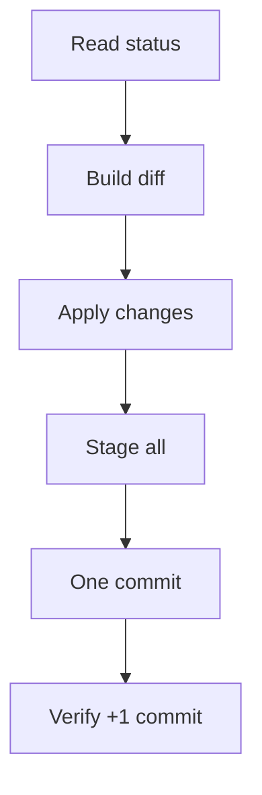

# I. Primer
## 1. TL;DR kiểu Feynman
- Mình hiểu đúng ý bạn: **chỉ tạo thêm 1 commit mới duy nhất** trên repo hiện tại `E:\NextJS\job\kdc`.
- **Không sửa, không rebase, không squash lại commit cũ, không rewrite history**.
- Commit mới này sẽ chứa toàn bộ thay đổi sync từ repo nguồn theo cách patch/diff.

## 2. Elaboration & Self-Explanation
- “Single-commit squash” ở ngữ cảnh này = gom tất cả thay đổi cần nhập vào **một commit mới**.
- Lịch sử hiện có của repo đích vẫn giữ nguyên 100%; chỉ nối thêm 1 node mới ở đầu branch.
- Không dùng force push, không thao tác làm đổi hash commit cũ.

## 3. Concrete Examples & Analogies
- Ví dụ: nếu hiện tại repo đích có `A -> B -> C`, sau khi làm xong sẽ là `A -> B -> C -> D` (D là commit sync duy nhất).
- Analogy: như đóng thêm 1 trang “phụ lục tổng hợp” vào cuối sổ, không xé hay sửa các trang trước.

# II. Audit Summary (Tóm tắt kiểm tra)
- Observation: bạn đã chốt rõ mục tiêu “1 commit duy nhất cho repo này, không đổi lịch sử”.
- Inference: cần quy trình chỉ tạo commit mới, không đụng commit graph cũ.
- Decision: thực thi theo luồng patch/diff -> stage -> commit 1 lần.

# III. Root Cause & Counter-Hypothesis (Nguyên nhân gốc & Giả thuyết đối chứng)
- Root cause: cần đồng bộ thay đổi lớn nhưng vẫn bảo toàn lịch sử hiện hữu.
- Counter-hypothesis bị loại:
  - Rebase/squash history: trái yêu cầu.
  - Reset/cherry-pick rewrite: có thể làm đổi graph cũ.
- Root Cause Confidence: **High** (yêu cầu đã rõ và nhất quán).

# IV. Proposal (Đề xuất)
1. Đọc trạng thái git hiện tại của repo đích (read-only).
2. Tạo diff từ repo nguồn sang repo đích theo phạm vi toàn repo.
3. Apply vào working tree repo đích.
4. Stage toàn bộ thay đổi.
5. Kiểm tra `git diff --cached` + `git status` trước commit.
6. Commit đúng 1 lần với message đã chốt: `feat(sync): squash import from system-vietadmin-nextjs`.
7. Xác nhận sau cùng: log tăng đúng 1 commit mới, không thay đổi commit cũ.

# V. Files Impacted (Tệp bị ảnh hưởng)
- Sửa: mọi file khác nhau giữa nguồn và đích.
- Thêm/Xóa: file chỉ tồn tại ở một phía sẽ được thêm/xóa tương ứng.
- Không sửa lịch sử commit trong `.git` (chỉ thêm commit mới).

# VI. Execution Preview (Xem trước thực thi)
1. Khảo sát trạng thái hiện tại.
2. Đồng bộ diff nguồn -> đích.
3. Stage + review staged diff.
4. Tạo 1 commit duy nhất.
5. Verify commit graph chỉ tăng thêm 1 node mới.

# VII. Verification Plan (Kế hoạch kiểm chứng)
- Không chạy lint/test/build (theo AGENTS.md).
- Dùng kiểm chứng git:
  - `git status`
  - `git diff --cached`
  - `git log --oneline -1`
  - So sánh `git rev-list --count HEAD` trước/sau để xác nhận chỉ +1 commit.

# VIII. Todo
1. Đọc trạng thái git trước khi sync.
2. Apply diff full-repo từ nguồn sang đích.
3. Stage toàn bộ thay đổi.
4. Review staged diff bảo mật.
5. Commit 1 lần với message đã chốt.
6. Verify chỉ thêm 1 commit mới, không rewrite history.

# IX. Acceptance Criteria (Tiêu chí chấp nhận)
- Repo `E:\NextJS\job\kdc` có đúng **1 commit mới**.
- Commit message đúng: `feat(sync): squash import from system-vietadmin-nextjs`.
- Không có thao tác rewrite history (rebase/reset --hard tới commit cũ/squash cũ).
- Không push remote.

# X. Risk / Rollback (Rủi ro / Hoàn tác)
- Rủi ro: conflict khi apply diff nếu khác biệt quá lớn.
- Rollback an toàn: nếu chưa push, reset về commit ngay trước commit mới.

# XI. Out of Scope (Ngoài phạm vi)
- Không chỉnh sửa lịch sử cũ.
- Không tách nhiều commit.
- Không push remote.

# XII. Open Questions (Câu hỏi mở)
- Không còn câu hỏi mở; yêu cầu đã rõ: **chỉ 1 commit mới, giữ nguyên toàn bộ history cũ**.