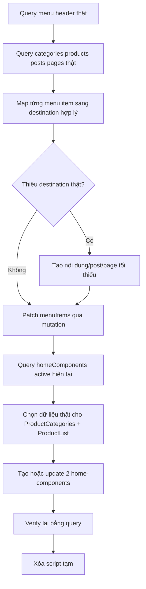
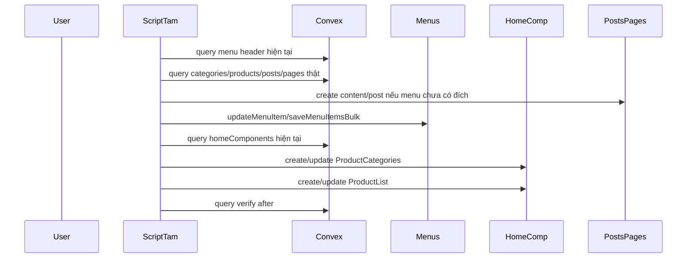

# I. Primer
## 1. TL;DR kiểu Feynman
- Hiện menu header đang có nhiều link `#` hoặc link seed mặc định, nên người dùng bấm vào không đi tới nội dung thật tương ứng với dữ liệu KDC đã có.
- Em sẽ không sửa mò trong UI trước; em sẽ đọc dữ liệu thật từ Convex để biết đang có sản phẩm, danh mục, bài viết và menu item nào.
- Sau đó em sẽ map lại từng menu item sang route hợp lý như `/products`, `/products?category=...`, `/posts/...`, `/about`, `/contact` hoặc tạo thêm nội dung/bài viết thật nếu menu đang trỏ tới chỗ chưa có destination phù hợp.
- Ở trang chủ, scope chỉ thêm `ProductList` và `ProductCategories`, lấy dữ liệu thật đang có trong Convex để hiển thị đúng catalog hiện tại.
- Nếu cần script JS để đọc/query hoặc tạo dữ liệu hỗ trợ thì em sẽ dùng script tạm, xong việc sẽ xóa để tránh dơ repo.
- Theo yêu cầu của anh: đây là thay đổi dữ liệu là chính, nên plan không bao gồm commit sau khi làm xong.

## 2. Elaboration & Self-Explanation
Bài này thực chất có 2 nhánh nhưng cùng chung một nguyên tắc: phải bám dữ liệu thật trong Convex, không bám seed mẫu cũ.

a) Với header menu:
- Header runtime đang đọc `api.menus.getFullMenu({ location: 'header' })` trong `components/site/Header.tsx`.
- Nghĩa là source of truth không phải hardcode UI mà là bảng `menus/menuItems` trong Convex.
- Vì vậy để sửa `#` thành link tốt, cách đúng là đọc menu hiện tại, đọc sản phẩm/danh mục/bài viết thật, rồi patch data menu item bằng mutation có sẵn (`updateMenuItem` hoặc `saveMenuItemsBulk`).
- Nếu một mục menu không có đích hợp lý sẵn, em sẽ tạo destination thật trước, ví dụ bài viết/landing/trust page, rồi mới trỏ menu vào đó.

b) Với trang chủ:
- Home page đang render bằng `api.homeComponents.listActive` tại `app/(site)/page.tsx` → `HomePageClient` → `HomeComponentRenderer`.
- `ProductList` và `ProductCategories` đã có runtime renderer sẵn trong registry/legacy renderer, nên chưa cần invent component mới.
- Bài toán đúng là bổ sung dữ liệu home component vào Convex để trang chủ hiện thêm section từ dữ liệu catalog thật.

Nói ngắn gọn: UI đã có sẵn đường ống hiển thị. Việc cần làm là sửa đúng data ở Convex và chỉ thêm rất ít glue code tạm nếu cần để đọc/ghi an toàn.

## 3. Concrete Examples & Analogies
Ví dụ menu mapping:
- Nếu header đang có item `Sản phẩm` trỏ `#` thì sẽ đổi thành `/products`.
- Nếu có menu con `Máy đo độ nhám` thì sẽ ưu tiên trỏ `/products?category=may-do-do-nham` hoặc route/filter thật mà site hiện đang hỗ trợ.
- Nếu có item `Giới thiệu` nhưng chưa có nội dung phù hợp, em sẽ kiểm tra route `/about`; nếu nội dung còn seed rỗng thì em sẽ tạo nội dung thật chuẩn chỉ trước rồi menu mới trỏ tới đó.
- Nếu có item `Tin tức` mà chưa có bài thật, em sẽ tạo một số bài viết thật bám KDC/catalog/đo lường để menu không dẫn tới trang rỗng.

Ví dụ home components:
- `ProductCategories`: lấy danh mục thật như `Máy đo độ nhám`, `Máy đo quang học`, `Máy đo tọa độ không gian 3 chiều` để dựng section nhóm ngành hàng.
- `ProductList`: lấy một tập sản phẩm thật đang active để làm section “Sản phẩm nổi bật” hoặc “Danh mục thiết bị đo lường”.

Analogy đời thường:
- Menu giống bảng chỉ đường trong showroom. Nếu biển chỉ sai hoặc chỉ vào tường (`#`) thì khách bị cụt luồng. Việc của em là đọc xem showroom hiện có khu nào thật rồi gắn lại biển chỉ đường đúng chỗ. Trang chủ thì giống khu trưng bày ngoài sảnh: có hàng thật rồi thì đem vài nhóm nổi bật ra trưng, không cần xây thêm showroom mới.

# II. Audit Summary (Tóm tắt kiểm tra)
- Observation: spec cũ nhập sản phẩm đã xác lập nguyên tắc làm việc đúng: đọc Convex thật trước, dùng query/mutation sẵn có, script tạm xong phải xóa.
- Observation: `components/site/Header.tsx` đang lấy menu từ `api.menus.getFullMenu({ location: 'header' })`; tức menu header là data-driven hoàn toàn.
- Observation: `convex/menus.ts` có sẵn các surface cần thiết: `getFullMenu`, `listMenuItems`, `updateMenuItem`, `saveMenuItemsBulk`, `listProductsForPicker`, `listPostsForPicker`, `listServicesForPicker`.
- Observation: `convex/seeders/menus.seeder.ts` vẫn là seed mặc định, có nhiều item generic như `Điện tử`, `Thời trang`, `Gia dụng`; đây gần như chắc chắn không phù hợp với catalog KDC.
- Observation: `app/(site)/page.tsx` + `HomePageClient` đang đọc `api.homeComponents.listActive`; home page cũng là data-driven từ Convex.
- Observation: `convex/homeComponents.ts` có sẵn CRUD data cho home components; không cần thêm schema mới chỉ để thêm section.
- Observation: `components/site/home/registry.tsx` và `components/site/ComponentRenderer.tsx` cho thấy `ProductList`, `ProductGrid`, `ProductCategories`, `HomepageCategoryHero` đều đã có renderer; scope user chỉ cần `ProductList` và `ProductCategories` nên không cần mở rộng thêm loại component.
- Observation: admin menu edit page (`app/admin/menus/[id]/edit/page.tsx`) cho thấy data model menu item hiện khá đơn giản: `label`, `url`, `order`, `depth`; phù hợp cho patch dữ liệu trực tiếp qua Convex.
- Observation: user xác nhận rõ 4 điểm scope:
  - tự map menu hợp lý nhất từ route + category/product thật,
  - nếu route còn thiếu thì có thể tạo nội dung/bài viết thật chuẩn chỉ,
  - home page chỉ thêm `ProductList` và `ProductCategories`,
  - chỉ dùng dữ liệu đang có thật trong Convex hiện tại,
  - không commit.

# III. Root Cause & Counter-Hypothesis (Nguyên nhân gốc & Giả thuyết đối chứng)
## Root Cause Confidence (Độ tin cậy nguyên nhân gốc): High
Lý do:
- Source of truth cho cả header menu và home page đều nằm ở dữ liệu Convex.
- Seed/default data hiện không còn khớp với catalog KDC thật đã nhập.
- Vấn đề chính không nằm ở renderer thiếu tính năng, mà nằm ở data chưa được remap/bổ sung theo catalog thật.

## Trả lời 5/8 câu bắt buộc theo Audit Protocol
1. Triệu chứng quan sát được là gì (expected vs actual)?
- Expected: menu header dẫn tới các trang/danh mục/nội dung thật; trang chủ có section sản phẩm/danh mục tương ứng với dữ liệu đang có.
- Actual: menu hiện có dấu hiệu vẫn còn link placeholder hoặc seed mặc định; trang chủ chưa bổ sung đủ section từ dữ liệu catalog thật.

2. Phạm vi ảnh hưởng (user, module, môi trường)?
- Ảnh hưởng trực tiếp user-facing site: header navigation và homepage.
- Module chạm tới: `menus`, `homeComponents`, có thể thêm `posts`/`trust pages` nếu cần tạo destination thật cho menu.
- Môi trường: deployment Convex hiện tại đang được project sử dụng.

3. Có tái hiện ổn định không? điều kiện tái hiện tối thiểu?
- Có. Chỉ cần header menu đang đọc từ menuItems seed/generic hoặc route đang trỏ `#` thì người dùng luôn gặp điều hướng chưa hợp lý.

4. Mốc thay đổi gần nhất (commit/config/dependency/data)?
- Evidence hiện tại nghiêng mạnh về “dữ liệu seed chưa được cập nhật sau khi catalog KDC thật đã được nhập”, không phải regression từ renderer.

5. Dữ liệu nào đang thiếu để kết luận chắc chắn?
- Chưa có snapshot menuItems/header thật trong deployment hiện tại.
- Chưa có snapshot homeComponents active hiện tại.
- Chưa biết site đang có bao nhiêu post/trust page usable để làm destination cho menu.

6. Có giả thuyết thay thế hợp lý nào chưa bị loại trừ?
- Có thể một phần vấn đề do route/filter của `/products` chưa hỗ trợ kiểu link category như menu cần. Điều này phải được kiểm tra bằng đọc route/query code và dữ liệu thật trước khi mutate menu.

7. Rủi ro nếu fix sai nguyên nhân là gì?
- Menu có thể trỏ tới route không hoạt động hoặc trang rỗng.
- Tạo home component sai source làm trang chủ hiển thị section nhưng không kéo được dữ liệu thật.
- Tạo thêm nội dung không khớp brand/catolog nếu suy diễn quá mức.

8. Tiêu chí pass/fail sau khi sửa?
- Header không còn link `#` cho các item public cần dùng.
- Mỗi menu item chính trỏ tới destination thật và hợp lý.
- Trang chủ có thêm `ProductList` và `ProductCategories` active, render được từ dữ liệu thật.
- Script tạm bị xóa sau khi hoàn tất.

## Counter-Hypothesis (Giả thuyết đối chứng)
- Giả thuyết A: chỉ cần sửa UI Header hardcode là đủ.
  - Bị bác bỏ vì header đang đọc hoàn toàn từ Convex menu data.
- Giả thuyết B: cần tạo loại home component mới.
  - Bị bác bỏ vì renderer hiện đã hỗ trợ `ProductList` và `ProductCategories`.
- Giả thuyết C: chỉ cần đổi mọi `#` sang `/products`.
  - Không đủ, vì user muốn “link dẫn tới hợp lý”, tức phải bám category/product/post/content thật chứ không patch một cách đồng loạt.

# IV. Proposal (Đề xuất)
## Option A (Recommend) — Confidence 92%
Thực hiện theo hướng data-first trên Convex: audit dữ liệu thật → map lại menu header → nếu thiếu destination thì tạo content/post thật tối thiểu → thêm 2 home-components bằng dữ liệu thật → verify lại bằng query.

Vì sao tốt nhất trong ngữ cảnh này:
- Bám đúng source of truth của site.
- Không cần thay đổi kiến trúc renderer.
- Phạm vi nhỏ, rollback dễ, đúng yêu cầu “không dơ repo”.
- Phù hợp với chỉ đạo của anh: có thể dùng script JS/Convex CLI/query để hiểu dữ liệu thật, nhưng làm xong phải dọn sạch.

### Luồng thực thi đề xuất

### Mermaid sequence cho data flow

## Chi tiết proposal
### 1. Audit dữ liệu thật trước khi sửa
Em sẽ đọc bằng query/CLI/script tạm các nhóm dữ liệu sau:
- header menu hiện tại: label/url/order/depth;
- categories thật: tên, slug, active, số sản phẩm;
- products thật: name, slug, categoryId/status;
- posts/trust pages/landing pages hiện có: title, slug, status;
- homeComponents active hiện tại: type/order/title/config summary.

### 2. Mapping strategy cho header menu
Nguyên tắc map:
- `Trang chủ` → `/`
- `Sản phẩm` → `/products`
- menu con danh mục → route/filter thật dựa trên slug category hiện có
- `Giới thiệu` → `/about` nếu page này đã có nội dung phù hợp; nếu chưa, tạo nội dung thật trước
- `Liên hệ` → `/contact`
- `Bài viết/Tin tức/Hướng dẫn` → `/posts` hoặc bài/category thật nếu có dữ liệu đủ tốt
- item nào đang `#` nhưng bản chất là nhóm trưng bày category thì ưu tiên đổi thành category/product-related links thật
- item nào generic seed không khớp KDC sẽ bị thay thế bằng các mục sát catalog thực tế hơn

Nguyên tắc tạo thêm content nếu cần:
- chỉ tạo khi thật sự cần để tránh menu trỏ vào trang rỗng;
- nội dung phải “chuẩn chỉ”, bám brand KDC/catalog thiết bị đo lường;
- nếu cần knowledge để viết chuẩn hơn, em sẽ dùng WebSearch có chọn lọc cho factual support;
- vẫn ưu tiên dữ liệu đang có thật trong Convex hiện tại, đúng chỉ đạo của anh.

### 3. Strategy cho home page
Scope chỉ gồm 2 sections:
- `ProductCategories`
- `ProductList`

Cách làm:
- Query homeComponents hiện có để tránh duplicate vô tội vạ.
- Nếu đã có section cùng type nhưng config xấu/seed/generic, em sẽ ưu tiên update section đó.
- Nếu chưa có, em sẽ create mới với order hợp lý sau các block đầu trang hiện tại.
- `ProductCategories` sẽ lấy danh mục thật có dữ liệu/sản phẩm tốt nhất.
- `ProductList` sẽ lấy sản phẩm active thật; config title/subheading sẽ viết theo ngữ cảnh KDC.

### 4. JS/script tạm
Nếu cần, em sẽ tạo script tạm kiểu:
- đọc snapshot dữ liệu Convex,
- gợi ý mapping menu,
- tạo content/post tối thiểu,
- patch menu/homeComponents.

Guardrails:
- script chỉ dùng local cho batch này;
- xong việc sẽ xóa khỏi repo;
- không để lại util chết hoặc file tạm.

# V. Files Impacted (Tệp bị ảnh hưởng)
## Data surfaces / read-write qua Convex
- Sửa: dữ liệu `menus` / `menuItems` trong Convex
  - Vai trò hiện tại: source of truth cho header/footer/sidebar navigation.
  - Thay đổi: remap URL menu header từ seed/placeholder sang destination thật phù hợp catalog và nội dung hiện có.

- Sửa: dữ liệu `homeComponents` trong Convex
  - Vai trò hiện tại: source of truth cho các section trang chủ.
  - Thay đổi: thêm hoặc cập nhật 2 section `ProductCategories` và `ProductList` dùng dữ liệu thật.

- Có thể sửa: dữ liệu `posts` hoặc page-like content liên quan (nếu thiếu destination cho menu)
  - Vai trò hiện tại: cung cấp nội dung thật cho các route bài viết/nội dung.
  - Thay đổi: chỉ tạo tối thiểu các nội dung thật cần thiết để menu không trỏ vào chỗ rỗng.

## Repo files có thể đụng trong quá trình thực thi
- Thêm rồi xóa: script tạm trong thư mục phù hợp của project
  - Vai trò hiện tại: chưa có.
  - Thay đổi: dùng để query/snapshot/mutate dữ liệu thật; xong việc sẽ xóa.

- Sửa: không dự kiến sửa `components/site/Header.tsx`
  - Vai trò hiện tại: renderer header đọc menu từ Convex.
  - Thay đổi: dự kiến không cần sửa code nếu data menu được sửa đúng.

- Sửa: không dự kiến sửa `app/(site)/page.tsx`, `HomePageClient`, `HomeComponentRenderer`
  - Vai trò hiện tại: renderer home page từ homeComponents active.
  - Thay đổi: dự kiến không cần sửa code vì chỉ cần thêm data đúng shape.

# VI. Execution Preview (Xem trước thực thi)
1. Đọc menu header thật bằng Convex query.
2. Đọc categories/products/posts/pages/homeComponents thật bằng Convex query.
3. Lập bảng map menu item hiện tại → destination mới.
4. Kiểm tra item nào cần tạo content/post/page trước khi gắn link.
5. Dùng mutation để patch menu items.
6. Kiểm tra homeComponents hiện tại để quyết định update hay create mới 2 section.
7. Tạo/cập nhật `ProductCategories`.
8. Tạo/cập nhật `ProductList`.
9. Query verify after để xác nhận menu URLs và homeComponents active đúng như mong muốn.
10. Xóa script tạm nếu có.

# VII. Verification Plan (Kế hoạch kiểm chứng)
- Verify trước khi mutate:
  - snapshot menu header hiện tại;
  - snapshot category/product/post/page/homeComponent hiện tại;
  - xác nhận route/filter cần dùng thật sự tồn tại hoặc có data support.
- Verify sau khi mutate:
  - query lại `getFullMenu('header')` để đảm bảo không còn `#` ở các item public cần dùng;
  - query lại homeComponents active để thấy `ProductCategories` và `ProductList` đã có mặt;
  - kiểm tra config các section bám đúng category/product thật;
  - nếu có tạo thêm posts/pages thì query lại theo slug để xác nhận tồn tại.
- Static review:
  - review mapping có hợp lý với brand KDC không;
  - review title/slug/content tạo mới có tự nhiên, không seed-mùi generic;
  - review script tạm đã bị xóa.
- Theo AGENTS repo: không chạy lint/test/build.

# VIII. Todo
1. Query dữ liệu thật từ Convex cho header menu, categories, products, posts/pages và homeComponents.
2. Lập mapping menu item → destination thật, xác định gap nội dung cần bổ sung.
3. Tạo script tạm hoặc dùng Convex CLI/function call để patch menu và tạo content cần thiết.
4. Thêm/cập nhật `ProductCategories` và `ProductList` trên trang chủ bằng dữ liệu thật.
5. Verify after bằng query và dọn sạch script/file tạm.

# IX. Acceptance Criteria (Tiêu chí chấp nhận)
- Header menu public không còn các link `#` vô nghĩa cho các mục chính cần dùng.
- Các menu item được map sang route/nội dung phù hợp với catalog KDC và dữ liệu thật đang có trong Convex.
- Nếu thiếu destination, đã có nội dung/bài viết thật tối thiểu để menu dẫn tới hợp lý.
- Trang chủ có thêm đúng 2 nhóm home-component: `ProductList` và `ProductCategories`.
- Hai section này lấy dữ liệu thật từ Convex, không dùng seed placeholder generic.
- Không để lại script/file tạm trong repo sau khi xong.
- Không commit.

# X. Risk / Rollback (Rủi ro / Hoàn tác)
- Rủi ro 1: map menu sang route lọc category nhưng route thực tế không parse query như kỳ vọng.
  - Giảm thiểu: đọc route products thật trước khi chốt URL pattern.
- Rủi ro 2: tạo thêm bài viết/nội dung nhưng chưa đủ chuẩn brand.
  - Giảm thiểu: chỉ tạo nội dung tối thiểu, bám factual evidence; nếu cần thì WebSearch có chọn lọc.
- Rủi ro 3: duplicate home component cùng loại làm trang chủ lặp section.
  - Giảm thiểu: query hiện trạng trước, ưu tiên update section cũ nếu hợp lý.
- Rollback:
  - menu: dùng snapshot before để patch ngược lại URL/label/order;
  - homeComponents: xóa section mới tạo hoặc restore config cũ;
  - content tạo mới: xóa đúng record vừa thêm nếu cần rollback.

# XI. Out of Scope (Ngoài phạm vi)
- Không refactor renderer Header hoặc kiến trúc home page nếu data patch đã đủ.
- Không thêm loại home component mới ngoài `ProductList` và `ProductCategories`.
- Không mở rộng sang redesign UI/UX tổng thể của header/home.
- Không commit/push.

# XII. Open Questions (Câu hỏi mở)
- Không còn ambiguity lớn về scope.
- Điểm cần xác minh trong lúc làm là pattern URL/filter thật của trang products/posts để chọn link menu chính xác nhất; việc này sẽ được trả lời bằng đọc code + query dữ liệu thật trước khi mutate.

## Root Cause Confidence (Độ tin cậy nguyên nhân gốc)
- High — evidence hiện tại cho thấy vấn đề nằm chủ yếu ở data seed/placeholder chưa được remap sau khi dữ liệu catalog thật đã có, không phải thiếu renderer.

## Ghi chú triển khai theo yêu cầu anh
- Em sẽ bám Convex query/mutation hiện có để nắm và sửa dữ liệu thật.
- Nếu cần JS/script tạm để query hoặc tạo dữ liệu hỗ trợ, em sẽ tạo rồi xóa sau khi hoàn thành.
- Không commit sau khi xong vì anh đã xác nhận đây là thay đổi dữ liệu thuần túy.