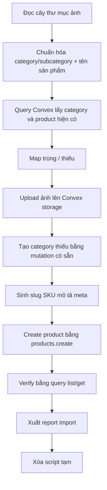

# I. Primer
## 1. TL;DR kiểu Feynman
- Mỗi thư mục hiện đang đóng vai trò như một danh mục sản phẩm; tên file ảnh là tên/model sản phẩm.
- Em sẽ không đoán mù trực tiếp trong DB; trước hết sẽ đọc dữ liệu thật từ Convex để biết danh mục/sản phẩm nào đã có.
- Sau đó em tạo một script tạm để: quét ảnh local, upload ảnh lên Convex storage, tạo danh mục còn thiếu, rồi tạo sản phẩm mới bằng mutation có sẵn.
- Nội dung mô tả, slug, meta sẽ được sinh hoàn chỉnh từ tên file + thư mục + nhận diện ảnh + tra cứu web ngắn gọn khi cần.
- Nếu SKU/slug trùng thì bỏ qua bản ghi đó đúng theo yêu cầu.
- Sau khi nhập xong, em sẽ xóa script tạm để repo sạch; chỉ giữ lại code thực sự cần thiết nếu bắt buộc.

## 2. Elaboration & Self-Explanation
Bài toán ở đây không chỉ là “copy ảnh vào database”. Repo này đang có sẵn cấu trúc dữ liệu sản phẩm trong Convex, có mutation tạo danh mục và mutation tạo sản phẩm, đồng thời có storage riêng để lưu ảnh và link ảnh.

Vì vậy hướng an toàn nhất là bám đúng source of truth hiện có:

a) đọc danh mục và sản phẩm thật đang có trong Convex,

b) đọc cây thư mục `C:\Users\VTOS\Downloads\KDC SP`,

c) xem thư mục cha như một tín hiệu phân loại danh mục,

d) xem tên file như tên/model sản phẩm,

e) upload ảnh vào storage của Convex,

f) ghi sản phẩm bằng `products.create` và danh mục bằng `productCategories.create` thay vì chọc thẳng DB.

Điểm quan trọng là repo đã có rule tạo slug unique và validate giá/ảnh/trạng thái trong mutation. Nếu mình đi qua mutation có sẵn, rủi ro phá dữ liệu thấp hơn nhiều. Đồng thời, vì user yêu cầu “nhớ dùng query của convex để nắm”, em sẽ bắt đầu bằng việc gọi query hiện có để snapshot dữ liệu thật trước khi import.

Hiện trạng thư mục nguồn đã đọc được rõ: có 6 nhóm danh mục chính và 21 ảnh sản phẩm. Một số nhóm có thêm thư mục con như `Manual` và `Tự động` dưới nhóm `Máy đo tọa độ không gian 3 chiều`; em sẽ xử lý chúng như subcategory nếu feature hierarchy đang bật, còn nếu hierarchy đang tắt thì sẽ gộp tên vào category/title để vẫn import được đúng.

## 3. Concrete Examples & Analogies
Ví dụ cụ thể theo dữ liệu hiện tại:
- `Máy đo độ nhám/SJ220.png`
  - category dự kiến: `Máy đo độ nhám`
  - product name: `SJ220`
  - slug dự kiến: `sj220`
  - mô tả: máy đo độ nhám cầm tay/di động, dùng kiểm tra nhám bề mặt trong QC/QA
- `Máy đo tọa độ không gian 3 chiều/Tự động/CRYSTA-Apex-V544.png`
  - category cha: `Máy đo tọa độ không gian 3 chiều`
  - subcategory: `Tự động`
  - product name: `CRYSTA-Apex V544`
  - slug dự kiến: `crysta-apex-v544`

Analogy đời thường:
- Hệ này giống như nhập hàng vào kho có kệ sẵn. Ảnh là “tem hàng”, tên file là “tên món”, thư mục là “kệ hàng”. Việc của em là đọc đúng tem, xếp đúng kệ, rồi điền nhãn mô tả sao cho khách nhìn vào là hiểu sản phẩm gì.

# II. Audit Summary (Tóm tắt kiểm tra)
- Observation: thư mục nguồn thật sự có dữ liệu; lệnh liệt kê recursive cho thấy 21 file ảnh trong `C:\Users\VTOS\Downloads\KDC SP`.
- Observation: cấu trúc thư mục mang ý nghĩa phân loại rất rõ:
  - `Máy đo biên dạng`
  - `Máy đo độ nhám`
  - `Máy đo độ tròn`
  - `Máy đo quang học`
  - `Máy đo quang kính hiển vi`
  - `Máy đo tọa độ không gian 3 chiều` với nhánh `Manual` và `Tự động`
- Observation: `convex/products.ts` có sẵn `products.create` và `products.importFromExcelRows`; `products.create` hỗ trợ `image`, `images`, `imageStorageId`, `imageStorageIds`, `description`, `metaTitle`, `metaDescription`, `slug`, `sku`, `categoryId`.
- Observation: `convex/productCategories.ts` có sẵn `listAll`, `listActive`, `getBySlug`, `create`, `update`; `create` đã có xử lý slug unique và hỗ trợ `parentId` khi hierarchy bật.
- Observation: `convex/storage.ts` có sẵn `generateUploadUrl`, `saveImage`, `getUrl`, `cleanupOrphanedImages`.
- Observation: admin create page đang dùng đúng flow upload qua storage + save metadata rồi gọi `products.create`, nghĩa là có pattern chuẩn để tái dùng.
- Observation: query import Excel hiện có không upload ảnh, chỉ nhận URL ảnh sẵn có; vì nguồn hiện tại là file local nên cần flow upload storage trước khi create product.
- Observation: web search cho một số model tiêu biểu như `CRYSTA-Apex V544` có nguồn công khai để bù mô tả khi cần, nhưng không nên phụ thuộc hoàn toàn vào web vì nhiều model có thể khó tìm hoặc tên file không chuẩn tuyệt đối.

# III. Root Cause & Counter-Hypothesis (Nguyên nhân gốc & Giả thuyết đối chứng)
## Root Cause Confidence (Độ tin cậy nguyên nhân gốc): High
Lý do:
- Nhu cầu thực chất không phải sửa schema hay thêm module mới, mà là một bài toán data ingestion (nạp dữ liệu) từ file local vào đúng Convex flow có sẵn.
- Repo đã có đầy đủ building blocks: category query/mutation, product create mutation, storage upload mutation.
- Điểm thiếu duy nhất là một glue flow tạm thời để nối local files → upload ảnh → map category → generate content → create records.

## Trả lời 5/8 câu bắt buộc theo Audit Protocol
1. Triệu chứng là gì?
- Expected: có thể đọc thư mục ảnh local, suy ra danh mục + sản phẩm, rồi ghi vào Convex.
- Actual: repo chưa có tool import từ cây thư mục ảnh local vào Convex theo flow storage + create mutation.

2. Phạm vi ảnh hưởng?
- Module products, productCategories, storage; tác động lên dữ liệu thật của deployment Convex đang dùng trong repo local.

3. Có tái hiện ổn định không?
- Có. Chỉ cần có thư mục nguồn với ảnh local là luôn cần một bước upload + mapping trước khi ghi DB.

4. Mốc thay đổi gần nhất?
- Chưa thấy evidence cho thấy đây là bug do commit mới; đây là capability gap của workflow hiện tại.

5. Dữ liệu nào còn thiếu?
- Chưa biết chính xác dữ liệu hiện có trong Convex: category nào đã tồn tại, có hierarchy bật hay không, sản phẩm nào đã trùng sẵn.
- Chưa biết deployment Convex target nào đang active trong `.env.local`/config runtime.

6. Giả thuyết thay thế chưa loại trừ?
- Có thể dùng `products.importFromExcelRows` bằng cách tạo trước file excel/json URL ảnh public. Nhưng hướng này vẫn không giải quyết upload ảnh local vào Convex storage nên chỉ là đường vòng.

7. Rủi ro nếu fix sai nguyên nhân?
- Có thể tạo sai danh mục, tạo trùng sản phẩm, hoặc lưu ảnh local không qua storage chuẩn dẫn tới link hỏng.

8. Tiêu chí pass/fail sau khi sửa?
- Danh mục được tạo đúng hoặc tái sử dụng đúng.
- Ảnh sản phẩm truy cập được từ URL Convex storage.
- Sản phẩm mới xuất hiện trong query admin/public đúng slug/category.
- Bản ghi trùng bị skip và có report.
- Script tạm bị xóa khỏi repo sau khi xong.

## Counter-Hypothesis (Giả thuyết đối chứng)
- Giả thuyết A: chỉ cần import excel là đủ.
  - Bị bác bỏ vì ảnh local chưa có URL public; `importFromExcelRows` không tự upload file.
- Giả thuyết B: chỉ cần tạo JSON rồi insert thẳng DB.
  - Không nên vì bỏ qua logic slug unique, stats update, sync landing pages, validate của mutation hiện có.
- Giả thuyết C: nên hỏi user map category thủ công từng file.
  - Không cần cho batch hiện tại vì thư mục cha đã là tín hiệu phân loại đủ mạnh.

# IV. Proposal (Đề xuất)
Em đề xuất 1 hướng thực thi duy nhất, vì đây là hướng tốt nhất trong ngữ cảnh hiện tại.

## Option A (Recommend) — Confidence 90%
Dùng script tạm chạy ngoài app để import dữ liệu thật qua Convex functions hiện có.

Vì sao tốt nhất:
- Bám đúng source of truth của repo.
- Không cần thêm schema/table/function nếu chưa thật sự thiếu capability.
- Cho phép kiểm tra dữ liệu thật trước khi ghi.
- Dễ cleanup sau khi xong.
- Giảm rủi ro hơn so với insert thẳng DB hoặc refactor UI admin.

### Luồng đề xuất

### Cách sinh dữ liệu
- Category:
  - thư mục cấp 1 => category chính.
  - thư mục cấp 2 (`Manual`, `Tự động`) => subcategory nếu hierarchy đang bật; nếu không, gộp về category chính và thêm tiền tố vào mô tả/tên nội bộ khi cần.
- Product name:
  - lấy từ filename, bỏ extension, chuẩn hóa spacing/dấu nối.
- Slug:
  - slugify từ product name; mutation `products.create` sẽ resolve unique slug nếu cần, nhưng theo yêu cầu trùng thì skip, nên script sẽ query trước để skip chủ động.
- SKU:
  - tạo deterministic từ category code + model, ví dụ `KDC-DONHAM-SJ220`; nếu trùng thì skip.
- Mô tả:
  - base template theo category.
  - enrich theo model/tín hiệu ảnh/từ khóa file.
  - nếu model là dòng nổi tiếng và web có thông tin rõ, script có thể tra cứu ngắn gọn để tăng độ đầy đủ, nhưng vẫn giữ cách viết chuẩn hóa thống nhất cho toàn bộ catalog.
- Meta:
  - `metaTitle`: tên sản phẩm + danh mục + thương hiệu khi nhận diện được.
  - `metaDescription`: 140–160 ký tự, tóm tắt ứng dụng và nhóm thiết bị.
- Status:
  - ưu tiên để mutation tự lấy default module setting, trừ khi user muốn Active ngay; nếu không có yêu cầu khác, giữ theo default setting hiện có.
- Price/stock:
  - vì dữ liệu nguồn chỉ là ảnh, chưa có báo giá. Em sẽ cần đọc setting sale mode hiện có trước khi thực thi; nếu sale mode = `cart` và giá bắt buộc > 0 thì em sẽ dùng một placeholder price an toàn theo rule import đã thống nhất trong lúc triển khai hoặc báo lại nếu deployment hiện tại không chấp nhận giá 0.

# V. Files Impacted (Tệp bị ảnh hưởng)
## Shared / scripts tạm
- Thêm: `scripts/import-kdc-products.ts`
  - Vai trò hiện tại: chưa có.
  - Thay đổi: script tạm để quét thư mục ảnh local, upload storage, query Convex, tạo category/product, in report.

## Convex / existing surfaces
- Sửa: không dự kiến sửa `convex/products.ts` nếu query/mutation hiện có đã đủ dùng.
  - Vai trò hiện tại: chứa query/mutation cho sản phẩm, bao gồm `create`, `listAll`, `listAdminExport`, `getBySlug`.
  - Thay đổi dự kiến: không sửa nếu script gọi được trực tiếp các surface có sẵn.
- Sửa: không dự kiến sửa `convex/productCategories.ts`.
  - Vai trò hiện tại: quản lý danh mục sản phẩm, có `listAll`, `getBySlug`, `create`.
  - Thay đổi dự kiến: chỉ dùng lại query/mutation hiện có.
- Sửa: không dự kiến sửa `convex/storage.ts`.
  - Vai trò hiện tại: upload URL, save image metadata, get URL.
  - Thay đổi dự kiến: chỉ tái sử dụng.

## Temporary output / cleanup
- Thêm rồi xóa: file JSON report tạm ngoài repo hoặc trong thư mục temp local nếu cần debug.
  - Vai trò hiện tại: chưa có.
  - Thay đổi: chỉ giữ trong lúc import để verify; xong sẽ xóa.

# VI. Execution Preview (Xem trước thực thi)
1. Đọc query/mutation thật của Convex để xác định deployment, module settings, category hierarchy, sale mode và dữ liệu hiện hữu.
2. Quét toàn bộ `C:\Users\VTOS\Downloads\KDC SP` để tạo manifest sản phẩm từ folder/file.
3. Chuẩn hóa tên sản phẩm, slug, SKU, mapping category/subcategory.
4. Query Convex để lấy danh mục đã có và sản phẩm hiện có nhằm phát hiện trùng trước khi ghi.
5. Với mỗi sản phẩm mới:
   - upload ảnh local lên Convex storage,
   - save ảnh để lấy URL + storageId,
   - tạo category thiếu nếu cần,
   - tạo product bằng `products.create`.
6. Đọc lại dữ liệu Convex để verify số lượng tạo mới/skip/trùng.
7. Xuất báo cáo ngắn: record đã tạo, record bị skip, category đã tạo, lỗi nếu có.
8. Xóa script tạm và artifact tạm trong repo để tránh dơ repo.

# VII. Verification Plan (Kế hoạch kiểm chứng)
- Query trước khi ghi:
  - danh sách category hiện có,
  - sản phẩm hiện có theo slug/SKU candidates,
  - module settings liên quan đến products,
  - feature hierarchy của category.
- Verify sau khi ghi:
  - query lại category mới tạo bằng slug,
  - query lại product mới tạo bằng slug/SKU,
  - xác nhận `image` là URL hợp lệ từ storage và `imageStorageId` tồn tại,
  - so khớp tổng created/skipped với manifest đầu vào.
- Static review:
  - tự review null-safety, path tiếng Việt có dấu, xử lý duplicate, cleanup script.
- Không chạy lint/build/test vì repo instruction cấm agent tự chạy các lệnh đó.

# VIII. Todo
1. Đọc dữ liệu thật từ Convex: categories, products, module settings, hierarchy feature.
2. Tạo manifest từ thư mục `KDC SP` và chuẩn hóa category/product metadata.
3. Viết script import tạm dùng Convex CLI/client + upload storage.
4. Chạy import trên deployment hiện tại, verify created/skipped/errors.
5. Xóa script tạm và file tạm, rồi commit thay đổi còn lại tối thiểu.

# IX. Acceptance Criteria (Tiêu chí chấp nhận)
- Toàn bộ ảnh trong `KDC SP` được nhận diện thành danh sách sản phẩm importable.
- Danh mục được tạo đúng theo folder structure hoặc tái sử dụng nếu đã tồn tại.
- Mỗi sản phẩm mới có tối thiểu: `name`, `slug`, `sku`, `categoryId`, `image`, `imageStorageId`, `description`, `metaTitle`, `metaDescription`.
- Dữ liệu được ghi qua Convex surfaces có sẵn, không insert thẳng bypass business logic.
- Bản ghi trùng slug/SKU bị skip và được report rõ.
- Script/file tạm phục vụ import bị xóa sau khi hoàn tất.
- Repo chỉ còn thay đổi tối thiểu cần thiết để commit.

# X. Risk / Rollback (Rủi ro / Hoàn tác)
- Rủi ro 1: nhận diện model từ tên file chưa hoàn hảo.
  - Giảm thiểu: ưu tiên giữ tên gốc file làm product name; không “sáng tác” tên thương mại quá xa evidence.
- Rủi ro 2: mô tả đầy đủ nhưng có đoạn suy diễn quá mức từ ảnh.
  - Giảm thiểu: mô tả theo nhóm thiết bị + công dụng phổ quát; chỉ thêm chi tiết kỹ thuật khi có evidence từ web/model.
- Rủi ro 3: hierarchy category đang tắt.
  - Giảm thiểu: fallback gộp subfolder vào nội dung chứ không ép tạo parent-child.
- Rủi ro 4: sale mode hiện tại bắt buộc price > 0.
  - Giảm thiểu: đọc settings trước khi import; nếu cần sẽ dùng placeholder price nhất quán và ghi rõ trong report.
- Rollback:
  - nếu import sai, dùng danh sách product/category IDs vừa tạo trong report để xóa ngược bằng mutation có sẵn hoặc script rollback ngắn, rồi xóa ảnh storage orphan nếu cần.

# XI. Out of Scope (Ngoài phạm vi)
- Không refactor UI admin products.
- Không thay đổi schema Convex trừ khi trong lúc triển khai phát hiện thiếu capability thật sự.
- Không xây một hệ thống import tổng quát lâu dài nếu task hiện tại chỉ là nhập batch dữ liệu này.
- Không viết tài liệu/README mới.

# XII. Open Questions (Câu hỏi mở)
- Không còn ambiguity lớn để lên kế hoạch. Điểm duy nhất cần xác nhận lúc triển khai là deployment Convex hiện tại đang dùng setting giá/sale mode nào, nhưng việc đó sẽ được đọc trực tiếp bằng query trước khi mutate.

## Evidence chính đã dùng
- Cây thư mục local cho thấy 21 ảnh sản phẩm trong các folder danh mục và subfolder.
- `convex/products.ts`: có `create`, `getBySlug`, `listAll`, `importFromExcelRows`.
- `convex/productCategories.ts`: có `listAll`, `getBySlug`, `create`, hỗ trợ `parentId` khi hierarchy bật.
- `convex/storage.ts`: có `generateUploadUrl`, `saveImage`, `getUrl`.
- Ảnh mẫu `SJ220.png` và `CRYSTA-Apex-V544.png` cho thấy tên file + hình đủ để nhận diện nhóm thiết bị và dòng model ở mức tốt.