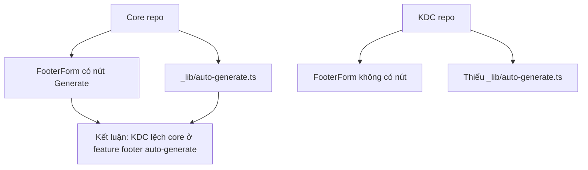

# I. Primer
## 1. TL;DR kiểu Feynman
- Đúng, project tham chiếu `E:\NextJS\study\admin-ui-aistudio\system-vietadmin-nextjs` có nút đó thật.
- KDC hiện không thấy nút vì đã thiếu phần sync/merge của footer auto-generate từ core sang.
- Cụ thể, core có thêm `FooterForm` button và helper `_lib/auto-generate.ts`, còn KDC chưa có.
- Với `trust-pages`, nút auto-generate ở `/admin/trust-pages` vẫn đang bị gate bởi feature `enableTrustPagesAutoGenerate` trong module `settings`.
- Chỗ bật/tắt từng trust page public vẫn là `/system/ia`, không đổi.

## 2. Elaboration & Self-Explanation
Lúc đầu em audit riêng KDC thì kết luận đúng theo code hiện tại: màn footer edit của KDC không có nút “Sinh footer chuẩn BCT/Google”. Sau khi anh đưa project tham chiếu, em đối chiếu lại thì thấy nguyên nhân không phải là “feature này chưa từng tồn tại”, mà là KDC đang bị lệch so với core.

Nói ngắn gọn: core đã có feature auto-generate footer chuẩn BCT/Google, nhưng bản KDC hiện tại chưa mang phần đó sang đầy đủ. Dấu hiệu rõ nhất là ở core có file helper riêng để dựng footer từ dữ liệu thật và có button trong `FooterForm`, còn ở KDC không có cả hai.

Về phần trust pages, có 2 công tắc khác nhau cần phân biệt:
- Công tắc hiện/ẩn nút “Sinh tự động từ dữ liệu thực” trong `/admin/trust-pages` là feature `enableTrustPagesAutoGenerate` của module `settings`.
- Công tắc bật/tắt từng route trust page public là ở `/system/ia`.

## 3. Concrete Examples & Analogies
Ví dụ đối chiếu thật:
- Core: `app/admin/home-components/footer/_components/FooterForm.tsx:553` có button `Sinh footer chuẩn BCT/Google`.
- Core: có thêm file `app/admin/home-components/footer/_lib/auto-generate.ts` để build patch footer từ settings/trust pages.
- KDC: `FooterForm.tsx` chỉ có block cấu hình BCT thủ công, không có button generate; đồng thời không có file `_lib/auto-generate.ts`.

Analogy:
- Core giống bản xe đã có sẵn nút “tự lái đoạn này”.
- KDC là bản xe cùng khung nhưng chưa gắn module tự lái đó vào dashboard, nên anh ngồi đúng chỗ vẫn không thấy nút.

# II. Audit Summary (Tóm tắt kiểm tra)
- Observation 1: KDC `app/admin/home-components/footer/[id]/edit/page.tsx` chỉ render `FooterForm`, preview và sticky footer; không có action auto-generate ở page level.
- Observation 2: KDC `app/admin/home-components/footer/_components/FooterForm.tsx` có section `Bộ Công Thương` thủ công nhưng không có button `Sinh footer chuẩn BCT/Google`.
- Observation 3: Core `app/admin/home-components/footer/_components/FooterForm.tsx:553` có button `Sinh footer chuẩn BCT/Google`.
- Observation 4: Core có file `app/admin/home-components/footer/_lib/auto-generate.ts`; KDC không có file tương ứng.
- Observation 5: KDC `app/admin/trust-pages/page.tsx` dùng `api.admin.modules.getModuleFeature({ moduleKey: 'settings', featureKey: 'enableTrustPagesAutoGenerate' })` để quyết định hiện nút auto-generate.
- Observation 6: KDC `lib/modules/configs/settings.config.ts` định nghĩa feature `enableTrustPagesAutoGenerate` trong module `settings`.
- Observation 7: KDC `convex/seed.ts` seed feature này với `enabled: false`, nên mặc định có thể đang OFF.
- Observation 8: KDC `app/system/ia/page.tsx` là surface bật/tắt từng trust page public.

# III. Root Cause & Counter-Hypothesis (Nguyên nhân gốc & Giả thuyết đối chứng)
- Root Cause 1 — High:
  - KDC đang thiếu phần sync feature footer auto-generate từ core.
  - Evidence: core có button + helper `_lib/auto-generate.ts`, KDC không có.
- Root Cause 2 — High:
  - `/admin/trust-pages` chỉ hiện nút auto-generate khi feature `enableTrustPagesAutoGenerate` bật.
  - Evidence: conditional render trong `app/admin/trust-pages/page.tsx`.
- Root Cause 3 — Medium:
  - KDC có thể đã sync nhiều phần khác từ core nhưng bỏ sót vùng footer/trust-pages custom nhạy cảm.
  - Evidence: repo có doc sync nhắc rõ trust-pages/admin/custom là vùng rủi ro cao.
- Counter-hypothesis A — Low:
  - Nút footer BCT bị ẩn bởi permission/runtime condition.
  - Evidence hiện tại không ủng hộ, vì KDC thiếu luôn code render button và helper backend/frontend liên quan.
- Counter-hypothesis B — Medium:
  - Feature trust auto-generate trên deployment thật có thể đã được bật dù seed mặc định false.
  - Cần đọc data runtime mới chốt 100%, nhưng code path thì đã rõ.
- Root Cause Confidence (Độ tin cậy nguyên nhân gốc): High
  - Vì đã có evidence đối chiếu trực tiếp giữa 2 codebase cùng feature surface.

# IV. Proposal (Đề xuất)
## 1. Hướng trả lời cho câu hỏi hiện tại
- Footer edit ở KDC không thấy nút vì KDC đang thiếu feature này so với core.
- Trust pages trong system có 2 nơi:
  - `/system/ia`: bật/tắt từng trust page public.
  - Module `settings` feature `enableTrustPagesAutoGenerate`: bật/tắt nút auto-generate trong `/admin/trust-pages`.

## 2. Nếu triển khai sync lại feature footer từ core
- Mang sang tối thiểu các phần sau:
  - `app/admin/home-components/footer/_lib/auto-generate.ts`
  - logic button trong `app/admin/home-components/footer/_components/FooterForm.tsx`
  - review tương thích type/config hiện tại của KDC trước khi nối wiring.
- Giữ scope nhỏ:
  - không đổi schema,
  - không mở rộng sang refactor footer toàn phần,
  - chỉ phục hồi feature generate footer chuẩn BCT/Google.

# V. Files Impacted (Tệp bị ảnh hưởng)
- Sửa: chưa có thay đổi nào vì hiện tại chỉ audit/compare trong spec mode.
- `E:\NextJS\job\kdc\app\admin\home-components\footer\_components\FooterForm.tsx`
  - Vai trò hiện tại: form cấu hình Footer của KDC.
  - Kết luận: chưa có nút generate footer chuẩn BCT/Google.
- `E:\NextJS\job\kdc\app\admin\home-components\footer\[id]\edit\page.tsx`
  - Vai trò hiện tại: route edit Footer của KDC.
  - Kết luận: chỉ bọc form/preview/save, không tự thêm action generate.
- `E:\NextJS\job\kdc\app\admin\trust-pages\page.tsx`
  - Vai trò hiện tại: admin route trust pages.
  - Kết luận: auto-generate bị gate bởi feature flag.
- `E:\NextJS\job\kdc\lib\modules\configs\settings.config.ts`
  - Vai trò hiện tại: định nghĩa features của module settings.
  - Kết luận: chứa feature `enableTrustPagesAutoGenerate`.
- `E:\NextJS\job\kdc\app\system\ia\page.tsx`
  - Vai trò hiện tại: system surface quản lý IA/trust route toggles.
  - Kết luận: đây là nơi bật/tắt từng trust page công khai.
- `E:\NextJS\study\admin-ui-aistudio\system-vietadmin-nextjs\app\admin\home-components\footer\_components\FooterForm.tsx`
  - Vai trò hiện tại: form Footer ở core.
  - Kết luận: có nút generate footer chuẩn BCT/Google.
- `E:\NextJS\study\admin-ui-aistudio\system-vietadmin-nextjs\app\admin\home-components\footer\_lib\auto-generate.ts`
  - Vai trò hiện tại: helper dựng patch footer tự động từ dữ liệu thật.
  - Kết luận: là mảnh ghép KDC đang thiếu.

# VI. Execution Preview (Xem trước thực thi)
1. So sánh `FooterForm` giữa core và KDC.
2. So sánh sự tồn tại của `_lib/auto-generate.ts` giữa 2 repo.
3. Xác nhận trust-pages auto-generate của KDC đang bị gate bởi feature nào.
4. Xác nhận system surface bật/tắt trust pages public.
5. Nếu anh duyệt bước tiếp theo, em sẽ viết spec/hoặc implement phục hồi feature từ core sang KDC theo patch tối thiểu.

# VII. Verification Plan (Kế hoạch kiểm chứng)
- Repro 1:
  - Mở KDC `/admin/home-components/footer/:id/edit`.
  - Expected: không có nút `Sinh footer chuẩn BCT/Google`.
- Repro 2:
  - Mở core repo cùng route Footer.
  - Expected: có nút `Sinh footer chuẩn BCT/Google`.
- Repro 3:
  - Mở KDC `/admin/trust-pages`.
  - Expected: nút auto-generate chỉ hiện khi `enableTrustPagesAutoGenerate` đang ON.
- Repro 4:
  - Mở KDC `/system/ia`.
  - Expected: thấy checkbox bật/tắt từng trust page public.
- Theo rule repo hiện tại: không chạy lint/test/build trong audit này.

# VIII. Todo
- [x] Audit KDC footer edit/trust pages surfaces.
- [x] Compare KDC với core repo về feature footer auto-generate.
- [x] Xác định đúng feature flag/system surface của trust pages.
- [ ] Nếu anh muốn, em có thể viết spec tiếp theo để sync đúng phần footer generate từ core sang KDC.

# IX. Acceptance Criteria (Tiêu chí chấp nhận)
- Xác nhận được core có nút footer generate, KDC không có.
- Chỉ ra nguyên nhân dựa trên file/path cụ thể.
- Trả lời rõ trust-pages bật/tắt ở đâu trong system.
- Phân biệt rõ 2 lớp toggle: auto-generate feature vs public trust page visibility.

# X. Risk / Rollback (Rủi ro / Hoàn tác)
- Không có rủi ro runtime vì chỉ audit read-only.
- Nếu sync feature từ core mà không review type/config KDC trước, có rủi ro mismatch nhỏ ở config/footer shape.
- Rollback sau này sẽ đơn giản vì scope dự kiến nhỏ, chủ yếu là UI/helper.

# XI. Out of Scope (Ngoài phạm vi)
- Chưa triển khai sync code.
- Chưa bật feature thật trong dữ liệu runtime.
- Chưa mutate Convex/moduleFeatures.

# XII. Open Questions (Câu hỏi mở)
- Anh muốn em dừng ở mức xác định nguyên nhân, hay viết luôn spec để kéo nút/logic generate footer từ core repo sang KDC?