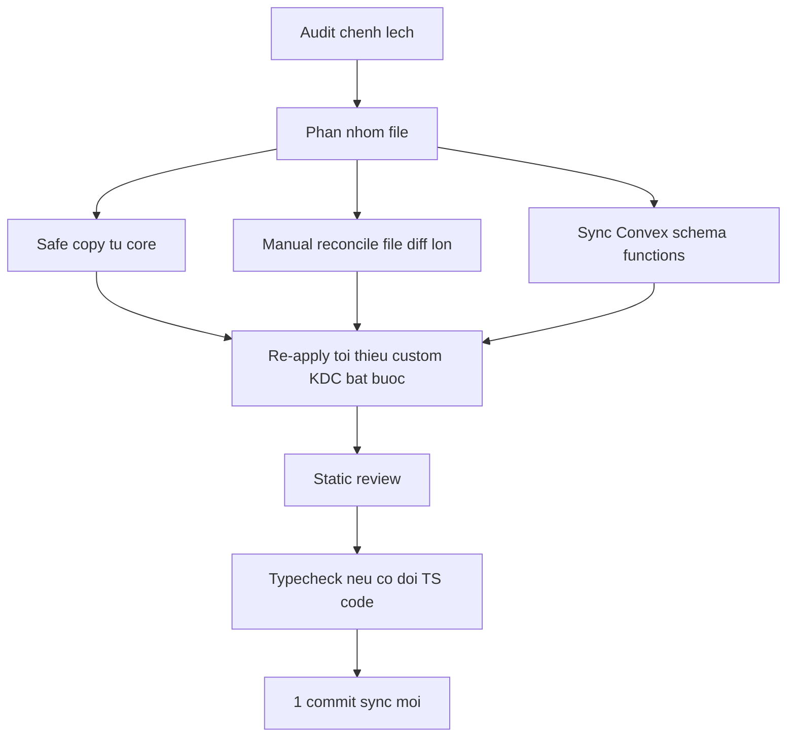

# I. Primer

## 1. TL;DR kiểu Feynman
- Repo KDC hiện đã có vài lần sync core trước đó, nhưng core mới lại tiến thêm ở nhiều cụm file nên hai bên đang lệch tiếp.
- Nếu mục tiêu là “bám core tối đa”, cách an toàn nhất không phải merge mù toàn repo, mà là lấy core làm baseline rồi nhập lại theo cụm tính năng.
- Khác biệt lớn nhất không nằm ở config gốc, mà nằm ở `app/`, `components/`, `lib/`, `convex/`.
- Có 3 vùng rủi ro cao: menu depth/custom KDC, services/trust-pages admin flow, và Convex schema/functions.
- Em sẽ gom toàn bộ sync vào đúng 1 commit mới trên nhánh hiện tại, không dọn lịch sử cũ, đúng theo lựa chọn của anh.
- Vì repo này có rule nội bộ “cấm tự chạy lint/unit test”, verification sẽ là review tĩnh + `bunx tsc --noEmit` nếu có đổi TS/code trước khi commit.

## 2. Elaboration & Self-Explanation
Bài toán ở đây không phải chỉ là “copy code từ core sang”. Nếu copy mù, các custom đang có ở KDC rất dễ bị ghi đè sai chỗ, nhất là những phần đã từng được chỉnh riêng cho menu, services, trust pages, hoặc dữ liệu Convex.

Quan sát cho thấy các file cấu hình nền như `package.json`, `next.config.ts`, `tsconfig.json` không lệch quá lớn; khác biệt dễ thấy nhất ở `eslint.config.mjs`. Nhưng phần làm hai repo khác nhau thật sự lại nằm ở các cụm feature: route site, shared UI runtime, homepage snapshot, guide pages trong system, và schema/function Convex.

Vì anh chọn hướng “bám core tối đa” và “tạo 1 commit mới trên hiện trạng”, hướng xử lý hợp lý là:

a) dùng core làm chuẩn nội dung cho phần lớn file,

b) nhập các file mới từ core trước,

c) với các file đang tồn tại ở cả hai repo nhưng diff lớn thì đối chiếu thủ công,

d) chỉ giữ lại các custom KDC nào thật sự bắt buộc.

Nói ngắn gọn: mình sẽ kéo KDC về gần core nhất có thể, nhưng không làm kiểu brute-force dễ gây vỡ feature ngầm.

## 3. Concrete Examples & Analogies
### a) Ví dụ cụ thể bám repo này
- Core có cụm file mới cho homepage snapshot:
  - `convex/homepageSnapshots.ts`
  - `components/modules/homepage/HomepageSnapshotDialog.tsx`
  - `lib/homepage-snapshot/*`
- Nếu chỉ copy UI dialog mà không sync `convex/schema.ts` và function liên quan, type/runtime sẽ lệch ngay vì KDC hiện chưa có bảng snapshot tương ứng.

### b) Analogy đời thường
- Việc này giống thay động cơ theo xe mẫu gốc: không thể chỉ thay mỗi nắp capo cho giống; phải thay theo cụm tương thích như động cơ, dây điện, cảm biến. Nếu thay lẻ tẻ, xe nhìn giống hơn nhưng chạy lỗi.

# II. Audit Summary (Tóm tắt kiểm tra)
- Observation:
  - KDC branch hiện có các commit sync/core trước đó: `ffbadc75`, `d51a30c9`.
  - Core mới đã đi tiếp với nhiều thay đổi sau đó.
  - KDC có custom gần đây liên quan menu/layout: `8dd27d89 feat(menu): enhance menu depth handling and improve layout responsiveness`.
- Observation:
  - Top-level config gần như tương đồng; khác biệt rõ nhất ở `eslint.config.mjs`.
- Observation:
  - Core có thêm nhiều file mà KDC chưa có, đáng chú ý:
    - `app/(site)/[categorySlug]/**`
    - `app/system/huong-dan/**`
    - `convex/homepageSnapshots.ts`
    - `components/modules/homepage/HomepageSnapshotDialog.tsx`
    - `components/site/GlobalSpeedDial.tsx`
    - `lib/homepage-snapshot/**`
- Observation:
  - Các file cùng tồn tại nhưng diff lớn, khả năng conflict cao:
    - `components/site/ComponentRenderer.tsx`
    - `components/site/Header.tsx`
    - `components/site/SiteShell.tsx`
    - `convex/admin/modules.ts`
    - `convex/schema.ts`
    - `convex/storage.ts`
    - `app/admin/services/create/page.tsx`
    - `app/admin/services/[id]/edit/page.tsx`
    - `app/admin/trust-pages/page.tsx`
- Inference:
  - Sync kiểu “copy all from core” có xác suất cao làm vỡ custom KDC ở menu/services/trust-pages hoặc gây mismatch Convex schema/runtime.
- Decision:
  - Chọn chiến lược sync theo cụm, vẫn tạo đúng 1 commit cuối cùng, nhưng thứ tự nhập phải có kiểm soát.

# III. Root Cause & Counter-Hypothesis (Nguyên nhân gốc & Giả thuyết đối chứng)
## 1. Root Cause Confidence (Độ tin cậy nguyên nhân gốc): High
- Lý do: có evidence trực tiếp từ lịch sử commit, các file chỉ-core, và các file cùng tồn tại nhưng diff lớn.

## 2. Root Cause
- Triệu chứng quan sát được là gì (expected vs actual)?
  - Expected: KDC gần với core mới nhất.
  - Actual: KDC mới gần core ở một số đợt sync cũ, nhưng hiện vẫn thiếu nhiều cụm file/logic mới từ core.
- Phạm vi ảnh hưởng?
  - User-facing site routes, shared site runtime, system pages, admin flows, Convex schema/functions.
- Có tái hiện ổn định không? điều kiện tái hiện tối thiểu?
  - Có. Chỉ cần đối chiếu cây file + diff các vùng trọng yếu là thấy divergence ổn định.
- Mốc thay đổi gần nhất?
  - Core có các commit mới hơn KDC; KDC cũng có custom menu gần đây làm tăng độ lệch.
- Dữ liệu nào đang thiếu?
  - Thiếu quyết định business về việc custom KDC nào là “bắt buộc giữ lại”. Với lựa chọn hiện tại, mặc định ưu tiên core tối đa.
- Có giả thuyết thay thế hợp lý nào chưa bị loại trừ?
  - Có: lệch chỉ do config hoặc chỉ do generated files. Nhưng evidence cho thấy khác biệt chính nằm ở source code/runtime, không phải generated artifacts.
- Rủi ro nếu fix sai nguyên nhân?
  - Sync nửa vời: giao diện giống core hơn nhưng runtime/schema vỡ.
- Tiêu chí pass/fail sau khi sửa?
  - Tree code gần core hơn rõ rệt, các cluster file quan trọng đã nhập đồng bộ, typecheck tĩnh pass, commit đơn đã tạo thành công.

## 3. Counter-Hypothesis (Giả thuyết đối chứng)
- Giả thuyết đối chứng 1: chỉ cần sync `eslint.config.mjs` và vài config là đủ.
  - Bác bỏ vì core có nhiều file feature mới mà KDC chưa có.
- Giả thuyết đối chứng 2: chỉ cần cherry-pick commit sync cũ là đủ.
  - Bác bỏ vì core hiện đã tiến tiếp sau các commit sync cũ của KDC.
- Giả thuyết đối chứng 3: copy toàn repo từ core sẽ nhanh nhất.
  - Đúng về tốc độ thao tác, nhưng sai về độ an toàn vì có cụm custom KDC và Convex mismatch.

# IV. Proposal (Đề xuất)
## 1. Hướng chọn
- Option A (Recommend) — Confidence 90%: Sync theo cụm, lấy core làm baseline, giữ đúng 1 commit mới trên branch hiện tại.
- Vì sao recommend:
  - Phù hợp đúng mong muốn của anh: bám core tối đa, không rewrite lịch sử cũ.
  - Dễ rollback hơn vì toàn bộ thay đổi nằm trong 1 commit.
  - Giảm rủi ro hơn so với overwrite toàn repo.

## 2. Cách thực hiện cụ thể
### a) Nhóm A — Safe copy từ core
- Sync các file chỉ có ở core hoặc cụm ít phụ thuộc custom KDC:
  - `app/(site)/[categorySlug]/**`
  - `app/system/huong-dan/**`
  - `convex/homepageSnapshots.ts`
  - `components/modules/homepage/HomepageSnapshotDialog.tsx`
  - `components/site/GlobalSpeedDial.tsx`
  - `lib/homepage-snapshot/**`
  - `eslint.config.mjs`

### b) Nhóm B — Manual reconcile các file diff lớn
- Đối chiếu core rồi cập nhật KDC theo core làm chuẩn cho:
  - `components/site/ComponentRenderer.tsx`
  - `components/site/Header.tsx`
  - `components/site/SiteShell.tsx`
  - `components/site/BlogSection.tsx`
  - `components/site/ProductListSection.tsx`
  - `components/site/ServiceListSection.tsx`
  - `components/site/HomepageCategoryHeroSection.tsx`
  - `lib/seo/internal-links.ts`
  - `lib/home-components/componentTypes.ts`
  - `lib/modules/configs/homepage.config.ts`
  - `lib/modules/configs/settings.config.ts`

### c) Nhóm C — Schema/data-sensitive
- Sync theo cụm đồng bộ để tránh mismatch:
  - `convex/schema.ts`
  - `convex/admin/modules.ts`
  - `convex/storage.ts`
  - `convex/migrationBundles.ts`
  - `convex/trustPages.ts`
  - `convex/auth.ts`
  - `convex/seed.ts`
- Rule ở đây là: nếu nhập UI/function của core phụ thuộc schema mới, phải nhập schema và wiring liên quan cùng đợt.

### d) Nhóm D — KDC custom cần xem là ngoại lệ, không phải chuẩn
- Review cẩn thận các vùng từng có custom KDC:
  - menu depth / preview
  - services admin flow
  - trust-pages admin flow
- Mặc định sẽ ưu tiên core; chỉ re-apply lại phần KDC nếu không re-apply thì sai business rõ ràng.

## 3. Commit strategy
- Toàn bộ thay đổi sẽ được stage thành 1 commit sync mới duy nhất.
- Không reset/cherry-pick lại lịch sử cũ.
- Commit message đề xuất:
  - `feat(sync): align KDC with latest system-vietadmin-nextjs core`

# V. Files Impacted (Tệp bị ảnh hưởng)
## 1. Config
- Sửa: `eslint.config.mjs`
  - Vai trò hiện tại: cấu hình lint/runtime rules của repo.
  - Thay đổi: đồng bộ rule set mới hơn từ core.

## 2. UI / App
- Thêm: `app/(site)/[categorySlug]/page.tsx`
  - Vai trò hiện tại: KDC chưa có route này.
  - Thay đổi: nhập route category từ core.
- Thêm: `app/(site)/[categorySlug]/[recordSlug]/page.tsx`
  - Vai trò hiện tại: KDC chưa có detail route dạng unified IA.
  - Thay đổi: nhập theo core.
- Thêm: `app/(site)/[categorySlug]/[recordSlug]/layout.tsx`
  - Vai trò hiện tại: KDC chưa có layout route này.
  - Thay đổi: nhập theo core.
- Thêm: `app/system/huong-dan/**`
  - Vai trò hiện tại: KDC chưa có cụm guides.
  - Thay đổi: nhập nguyên cụm từ core.
- Sửa: `app/system/layout.tsx`
  - Vai trò hiện tại: khung layout cho system area.
  - Thay đổi: đồng bộ wiring gần core hơn nếu có dependency từ cụm guides/runtime.
- Sửa: `app/admin/services/create/page.tsx`
  - Vai trò hiện tại: màn create service của KDC.
  - Thay đổi: đối chiếu core rồi sync theo baseline mới.
- Sửa: `app/admin/services/[id]/edit/page.tsx`
  - Vai trò hiện tại: màn edit service của KDC.
  - Thay đổi: reconcile với core, giữ custom bắt buộc nếu có.
- Sửa: `app/admin/trust-pages/page.tsx`
  - Vai trò hiện tại: admin trust pages.
  - Thay đổi: align lại theo flow core mới nhất nếu cần.

## 3. Shared / Components
- Sửa: `components/site/ComponentRenderer.tsx`
  - Vai trò hiện tại: router/renderer trung tâm cho site components.
  - Thay đổi: lấy core làm chuẩn để tránh lệch component contract.
- Sửa: `components/site/Header.tsx`
  - Vai trò hiện tại: header runtime của site.
  - Thay đổi: sync logic/render gần core.
- Sửa: `components/site/SiteShell.tsx`
  - Vai trò hiện tại: shell chính của site runtime.
  - Thay đổi: đồng bộ wiring/core behaviors.
- Thêm: `components/modules/homepage/HomepageSnapshotDialog.tsx`
  - Vai trò hiện tại: KDC chưa có.
  - Thay đổi: nhập dialog snapshot từ core.
- Thêm: `components/site/GlobalSpeedDial.tsx`
  - Vai trò hiện tại: KDC chưa có.
  - Thay đổi: nhập từ core.
- Sửa: `components/experiences/previews/HeaderMenuPreview.tsx`
  - Vai trò hiện tại: preview menu editor.
  - Thay đổi: review kỹ vì đây là vùng KDC đã custom.

## 4. Convex / Data
- Sửa: `convex/schema.ts`
  - Vai trò hiện tại: schema source of truth của Convex.
  - Thay đổi: thêm/sync schema cần thiết để khớp các feature core mới.
- Thêm: `convex/homepageSnapshots.ts`
  - Vai trò hiện tại: KDC chưa có function này.
  - Thay đổi: nhập từ core.
- Sửa: `convex/admin/modules.ts`
  - Vai trò hiện tại: module admin/data wiring quan trọng.
  - Thay đổi: sync theo core và kiểm soát vùng menu/modules.
- Sửa: `convex/storage.ts`
  - Vai trò hiện tại: storage-related mutations/helpers.
  - Thay đổi: đồng bộ core behavior.
- Sửa: `convex/trustPages.ts`
  - Vai trò hiện tại: trust pages data logic.
  - Thay đổi: align với core nếu flow đã đổi.

## 5. Shared Lib
- Thêm: `lib/homepage-snapshot/client.ts`
  - Vai trò hiện tại: KDC chưa có client helper này.
  - Thay đổi: nhập từ core.
- Thêm: `lib/homepage-snapshot/types.ts`
  - Vai trò hiện tại: KDC chưa có type contract này.
  - Thay đổi: nhập từ core.
- Sửa: `lib/seo/internal-links.ts`
  - Vai trò hiện tại: internal link helpers cho SEO/runtime.
  - Thay đổi: sync theo core để khớp route/IA mới.

# VI. Execution Preview (Xem trước thực thi)
1. Đọc diff theo nhóm `config`, `app`, `components`, `convex`, `lib`.
2. Copy/import các file mới chỉ có ở core.
3. Cập nhật các file shared/runtime lấy core làm baseline.
4. Sync cụm Convex schema + function liên quan thành một nhóm đồng bộ.
5. Reconcile các file admin/service/trust-pages và menu-preview là vùng custom nhạy cảm.
6. Tự review tĩnh: typing, null-safety, compatibility với dữ liệu cũ.
7. Chạy `bunx tsc --noEmit` vì có đổi code/TS.
8. Review `git status` + `git diff --cached` + kiểm tra secret/sensitive data.
9. Tạo đúng 1 commit sync mới.

# VII. Verification Plan (Kế hoạch kiểm chứng)
- Không chạy lint/unit test theo rule repo.
- Verification sẽ gồm:
  - review tĩnh từng cụm file đã đổi,
  - đối chiếu import/export/type contracts,
  - rà các dependency giữa UI ↔ Convex schema/functions,
  - chạy `bunx tsc --noEmit` trước commit vì có thay đổi code TypeScript,
  - kiểm tra `git status` và `git diff --cached` để chắc chỉ commit đúng phạm vi sync.
- Pass khi:
  - không còn mismatch type/import do cụm sync mới,
  - các file core-cluster đã nhập đủ theo dependency,
  - commit đơn được tạo thành công.
- Fail khi:
  - còn file feature được copy nhưng thiếu schema/wiring tương ứng,
  - còn giữ custom KDC làm lệch contract core mà không có lý do business rõ ràng.

# VIII. Todo
- [ ] So sánh chi tiết theo từng cụm file ưu tiên cao giữa KDC và core.
- [ ] Nhập các file mới chỉ có ở core.
- [ ] Reconcile các file shared/runtime diff lớn theo baseline core.
- [ ] Sync đồng bộ Convex schema và functions liên quan.
- [ ] Review các custom KDC nhạy cảm: menu, services, trust-pages.
- [ ] Tự review tĩnh và chạy `bunx tsc --noEmit`.
- [ ] Tạo 1 commit sync mới duy nhất.

# IX. Acceptance Criteria (Tiêu chí chấp nhận)
- Repo KDC có thêm một commit mới duy nhất cho đợt sync này.
- Các cụm file mới từ core đã được nhập đầy đủ, không nửa vời.
- Các file runtime/shared trọng yếu đã được kéo gần core nhất có thể.
- Các vùng custom KDC nhạy cảm chỉ được giữ lại nếu thật sự cần.
- `bunx tsc --noEmit` pass trước khi commit.
- `git diff --cached` không chứa secret, env value thật, hay file ngoài phạm vi sync cần thiết.

# X. Risk / Rollback (Rủi ro / Hoàn tác)
- Rủi ro:
  - mismatch Convex schema/function,
  - overwrite custom KDC đang cần dùng,
  - sync thiếu cụm dependency làm runtime lệch.
- Rollback:
  - vì tất cả nằm trong 1 commit mới, có thể rollback gọn bằng revert commit đó nếu cần.
  - nếu phát hiện một cụm core gây vỡ, có thể bỏ cả cụm đó trong lần làm hiện tại trước khi commit để giữ atomicity.

# XI. Out of Scope (Ngoài phạm vi)
- Không dọn lịch sử git cũ.
- Không push remote.
- Không refactor thêm ngoài mục tiêu sync gần core.
- Không productize tooling/script mới chỉ để phục vụ lần sync này.
- Không sửa dữ liệu thật trong Convex trừ khi phát sinh dependency bắt buộc và anh yêu cầu riêng.

# XII. Open Questions (Câu hỏi mở)
- Hiện chưa có ambiguity chặn triển khai vì anh đã chốt:
  - ưu tiên bám core tối đa,
  - tạo 1 commit mới trên hiện trạng.
- Khi thực thi, nếu gặp custom KDC có dấu hiệu là business-critical, em sẽ giữ tối thiểu phần đó thay vì overwrite mù.