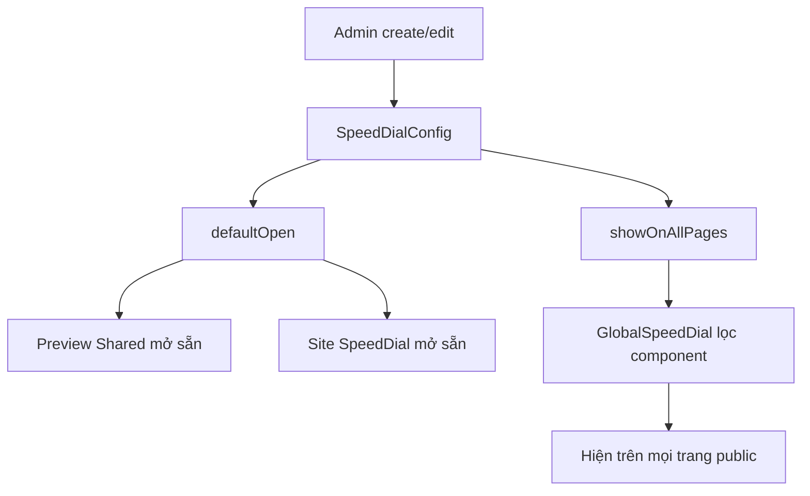

# I. Primer
## 1. TL;DR kiểu Feynman
- Core đã có đủ 2 option cho Speed Dial: `Mặc định mở` và `Hiển thị toàn site public`; KDC chưa có ở create/edit admin.
- KDC cũng chưa mang đủ wiring để preview/site render hiểu `defaultOpen`.
- Phần `showOnAllPages` ở KDC site public thực ra đã có `GlobalSpeedDial`, nên thiếu chủ yếu là mặt admin config + type/default + preview/site normalize `defaultOpen`.
- Để giống core `/admin/home-components/create/speed-dial` và edit, chỉ cần sync tối thiểu 7 điểm chạm quanh Speed Dial, không cần đổi schema.
- Scope này là patch nhỏ, rollback dễ, bám đúng pattern core đang dùng.

## 2. Elaboration & Self-Explanation
Hiện tại KDC và core đang lệch nhau ở bề mặt quản trị Speed Dial. Trong core, admin có thể bật 2 toggle:
- `Mặc định mở`: khi vào site, cụm Speed Dial bung sẵn.
- `Hiển thị toàn site public`: Speed Dial không chỉ render ở homepage flow mà còn hiện ở mọi trang public qua `GlobalSpeedDial`.

KDC đang thiếu phần này ở admin create/edit. Khi đọc code đối chiếu, em thấy:
- Core create/edit page đã giữ state `defaultOpen` và `showOnAllPages`, rồi submit cùng `SpeedDialConfig`.
- Core `SpeedDialForm` đã có 2 toggle UI.
- Core `SpeedDialPreview` và `SpeedDialSectionShared` đã truyền/nhận `defaultOpen` để preview/site thể hiện đúng trạng thái mở sẵn.
- Core `SpeedDialSection.tsx` normalize `defaultOpen` từ config site.
- Còn `showOnAllPages` ở public site thì KDC thực ra đã có `GlobalSpeedDial.tsx` giống core rồi; nó đang lọc `config.showOnAllPages === true` để render toàn site.

Nói ngắn gọn: KDC đã có “đầu ra” cho `showOnAllPages`, nhưng chưa có “chỗ nhập cấu hình” tương ứng trong admin; và cũng chưa sync đầy đủ `defaultOpen` từ admin -> preview/site.

## 3. Concrete Examples & Analogies
Ví dụ cụ thể:
- Core `app/admin/home-components/create/speed-dial/page.tsx` có state `defaultOpen`, `showOnAllPages` và truyền xuống `SpeedDialForm`.
- KDC file tương ứng chỉ có `actions`, `style`, `position`, nên admin không có cách bật 2 option này.
- Core `app/admin/home-components/speed-dial/_types/index.ts` có:
  - `defaultOpen: boolean`
  - `showOnAllPages: boolean`
- KDC `_types/index.ts` chưa có 2 field này.

Analogies:
- KDC hiện giống cái công tắc đèn ngoài sân đã có dây điện chạy tới bóng, nhưng trong nhà chưa gắn công tắc lên tường. Nghĩa là logic public đã có một phần, nhưng admin chưa điều khiển được.

# II. Audit Summary (Tóm tắt kiểm tra)
- Observation 1: KDC `create/speed-dial/page.tsx` chưa có state/submit cho `defaultOpen`, `showOnAllPages`; core có.
- Observation 2: KDC `speed-dial/[id]/edit/page.tsx` chưa normalize, snapshot, submit 2 field này; core có.
- Observation 3: KDC `speed-dial/_components/SpeedDialForm.tsx` chưa có 2 toggle UI; core có đầy đủ label/help text.
- Observation 4: KDC `speed-dial/_components/SpeedDialPreview.tsx` chưa nhận `defaultOpen`; core có truyền prop này xuống preview shared.
- Observation 5: KDC `speed-dial/_components/SpeedDialSectionShared.tsx` chưa nhận `defaultOpen` và chưa seed state mở ban đầu từ config; core có.
- Observation 6: KDC `speed-dial/_types/index.ts` và `_lib/constants.ts` chưa khai báo default config cho 2 field; core có `defaultOpen: true`, `showOnAllPages: false`.
- Observation 7: KDC `components/site/SpeedDialSection.tsx` chưa normalize `defaultOpen`; core có.
- Observation 8: KDC `components/site/GlobalSpeedDial.tsx` và `components/site/SiteShell.tsx` đã gần như giống core, nghĩa là phần render toàn site public đã có sẵn nền.

# III. Root Cause & Counter-Hypothesis (Nguyên nhân gốc & Giả thuyết đối chứng)
- Root Cause 1 — High:
  - KDC chưa sync phần admin config/model cho 2 field `defaultOpen` và `showOnAllPages` từ core.
  - Evidence: chênh lệch rõ ở create/edit page, form, types, constants.
- Root Cause 2 — High:
  - KDC chưa sync phần preview/site runtime cho `defaultOpen`.
  - Evidence: `SpeedDialPreview.tsx`, `SpeedDialSectionShared.tsx`, `components/site/SpeedDialSection.tsx` của KDC thiếu prop/normalize tương ứng.
- Root Cause 3 — Medium:
  - `showOnAllPages` runtime ở KDC đã có sẵn qua `GlobalSpeedDial`, nên vấn đề chính không nằm ở public shell mà nằm ở admin/data contract.
  - Evidence: `GlobalSpeedDial.tsx` ở KDC đã lọc `config.showOnAllPages` giống core.
- Counter-hypothesis A — Low:
  - Có thể KDC dùng field legacy khác như `alwaysOpen` thay cho `defaultOpen`.
  - Evidence hiện tại chỉ thấy legacy editor cũ có `alwaysOpen`, nhưng flow create/edit mới không dùng contract này.
- Root Cause Confidence (Độ tin cậy nguyên nhân gốc): High
  - Vì diff giữa core và KDC rất trực tiếp, ít ambiguity.

# IV. Proposal (Đề xuất)
## 1. Mục tiêu
Sync KDC để `/admin/home-components/create/speed-dial` và edit behave y hệt core cho 2 tính năng:
- `Mặc định mở`
- `Hiển thị toàn site public`

## 2. Phạm vi thay đổi đề xuất
### a) Data contract
- Thêm vào `SpeedDialConfig`:
  - `defaultOpen: boolean`
  - `showOnAllPages: boolean`
- Cập nhật `DEFAULT_SPEED_DIAL_CONFIG` với mặc định giống core:
  - `defaultOpen: true`
  - `showOnAllPages: false`

### b) Admin create/edit
- Create page:
  - thêm state cho `defaultOpen`, `showOnAllPages`
  - truyền vào `SpeedDialForm`
  - submit 2 field này vào config
- Edit page:
  - thêm `normalizeBoolean`
  - load config cũ với fallback từ `DEFAULT_SPEED_DIAL_CONFIG`
  - thêm 2 field vào snapshot để detect dirty state đúng
  - submit 2 field này khi save

### c) Admin form/preview
- `SpeedDialForm`:
  - thêm 2 toggle UI và helper text đúng như core
- `SpeedDialPreview`:
  - nhận prop `defaultOpen`
  - truyền xuống `SpeedDialSectionShared`
- `SpeedDialSectionShared`:
  - thêm prop `defaultOpen?: boolean`
  - state `isOpen` khởi tạo theo `defaultOpen`
  - sync lại khi prop đổi

### d) Site runtime
- `components/site/SpeedDialSection.tsx`:
  - normalize `defaultOpen`
  - truyền vào `SpeedDialSectionShared`
- `GlobalSpeedDial.tsx` và `SiteShell.tsx`:
  - audit cho thấy đã đúng, không cần đổi nếu giữ scope tối thiểu.

# V. Files Impacted (Tệp bị ảnh hưởng)
- Sửa: `app/admin/home-components/create/speed-dial/page.tsx`
  - Vai trò hiện tại: tạo Speed Dial mới.
  - Thay đổi: thêm state + submit cho `defaultOpen`, `showOnAllPages`.
- Sửa: `app/admin/home-components/speed-dial/[id]/edit/page.tsx`
  - Vai trò hiện tại: chỉnh sửa Speed Dial.
  - Thay đổi: load/normalize/snapshot/save 2 field mới.
- Sửa: `app/admin/home-components/speed-dial/_components/SpeedDialForm.tsx`
  - Vai trò hiện tại: form admin Speed Dial.
  - Thay đổi: thêm 2 toggle giống core.
- Sửa: `app/admin/home-components/speed-dial/_components/SpeedDialPreview.tsx`
  - Vai trò hiện tại: preview admin.
  - Thay đổi: truyền `defaultOpen` xuống shared preview.
- Sửa: `app/admin/home-components/speed-dial/_components/SpeedDialSectionShared.tsx`
  - Vai trò hiện tại: render dùng chung cho preview/site.
  - Thay đổi: nhận `defaultOpen`, khởi tạo open state theo prop.
- Sửa: `app/admin/home-components/speed-dial/_types/index.ts`
  - Vai trò hiện tại: contract type cho Speed Dial config.
  - Thay đổi: thêm `defaultOpen`, `showOnAllPages`.
- Sửa: `app/admin/home-components/speed-dial/_lib/constants.ts`
  - Vai trò hiện tại: default config Speed Dial.
  - Thay đổi: thêm default values cho 2 field mới.
- Sửa: `components/site/SpeedDialSection.tsx`
  - Vai trò hiện tại: site renderer cho Speed Dial.
  - Thay đổi: normalize và pass `defaultOpen`.

## Không cần sửa nếu giữ scope tối thiểu
- `components/site/GlobalSpeedDial.tsx`
  - Vai trò hiện tại: render Speed Dial toàn site khi `showOnAllPages=true`.
  - Nhận định: hiện đã khớp core.
- `components/site/SiteShell.tsx`
  - Vai trò hiện tại: mount `GlobalSpeedDial` ở shell public.
  - Nhận định: hiện đã khớp core.

# VI. Execution Preview (Xem trước thực thi)
1. Sync types + constants để data contract khớp core.
2. Sync create page để admin tạo mới có đủ 2 toggle.
3. Sync edit page để admin sửa item cũ/new đều đúng fallback.
4. Sync form/preview/shared rendering cho `defaultOpen`.
5. Sync site renderer `SpeedDialSection.tsx` để runtime mở sẵn đúng config.
6. Tự review tĩnh null-safety, backward compatibility với item cũ chưa có field.

# VII. Verification Plan (Kế hoạch kiểm chứng)
- Case 1: Create mới Speed Dial, bật `Mặc định mở`.
  - Expected: preview admin bung sẵn khi render.
- Case 2: Create mới Speed Dial, bật `Hiển thị toàn site public`.
  - Expected: config lưu được field này; site shell có thể pick qua `GlobalSpeedDial`.
- Case 3: Edit item cũ chưa có 2 field.
  - Expected: fallback an toàn về `DEFAULT_SPEED_DIAL_CONFIG`.
- Case 4: Edit item có `defaultOpen=false`.
  - Expected: preview/site giữ trạng thái đóng mặc định.
- Case 5: Item `showOnAllPages=false`.
  - Expected: không bị `GlobalSpeedDial` render toàn site.
- Theo rule repo: không chạy lint/test/build; chỉ self-review tĩnh.

# VIII. Todo
- [ ] Sync data contract SpeedDial với core.
- [ ] Sync create/edit admin pages cho 2 field mới.
- [ ] Sync form + preview + shared runtime cho `defaultOpen`.
- [ ] Xác nhận `showOnAllPages` tận dụng đúng `GlobalSpeedDial` hiện có.
- [ ] Tự review tĩnh backward compatibility với dữ liệu cũ.

# IX. Acceptance Criteria (Tiêu chí chấp nhận)
- `/admin/home-components/create/speed-dial` có 2 toggle giống core.
- `/admin/home-components/speed-dial/[id]/edit` load/save đúng 2 toggle giống core.
- Preview admin phản ánh đúng `Mặc định mở`.
- Site runtime phản ánh đúng `defaultOpen`.
- `showOnAllPages=true` cho phép component được `GlobalSpeedDial` pick để hiện toàn site public.
- Không đổi behavior ngoài scope Speed Dial.

# X. Risk / Rollback (Rủi ro / Hoàn tác)
- Rủi ro nhỏ: item cũ không có field mới nếu normalize thiếu fallback sẽ gây lệch preview/edit.
- Giảm rủi ro bằng fallback boolean từ `DEFAULT_SPEED_DIAL_CONFIG` như core.
- Rollback đơn giản vì chỉ chạm UI/type/runtime local, không migration schema.

# XI. Out of Scope (Ngoài phạm vi)
- Không refactor legacy SpeedDial editor cũ.
- Không thay đổi GlobalSpeedDial/SiteShell nếu audit cho thấy đã khớp core.
- Không mở rộng thêm feature mới ngoài 2 toggle được nêu.

# XII. Open Questions (Câu hỏi mở)
- Không còn ambiguity lớn; evidence đủ để sync theo core gần như 1:1.