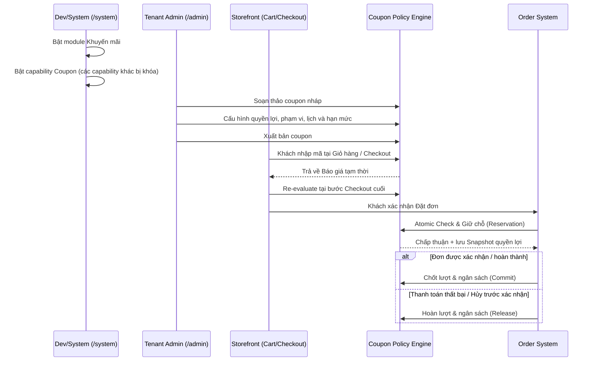
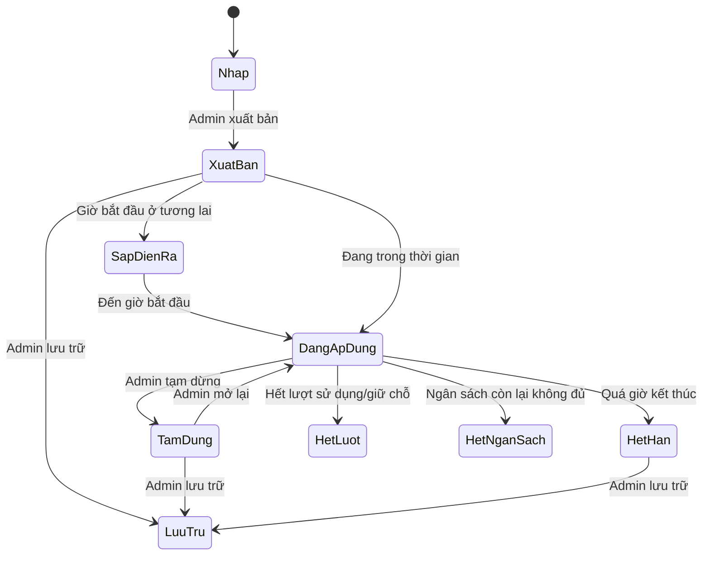
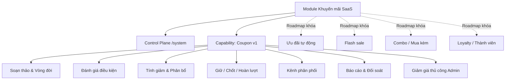
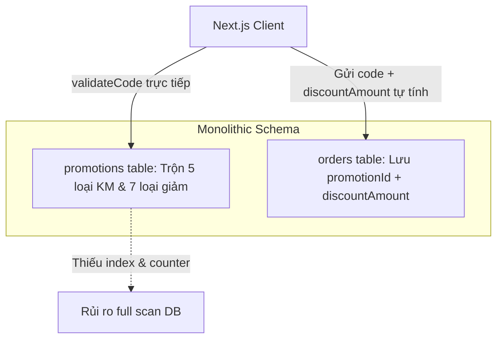
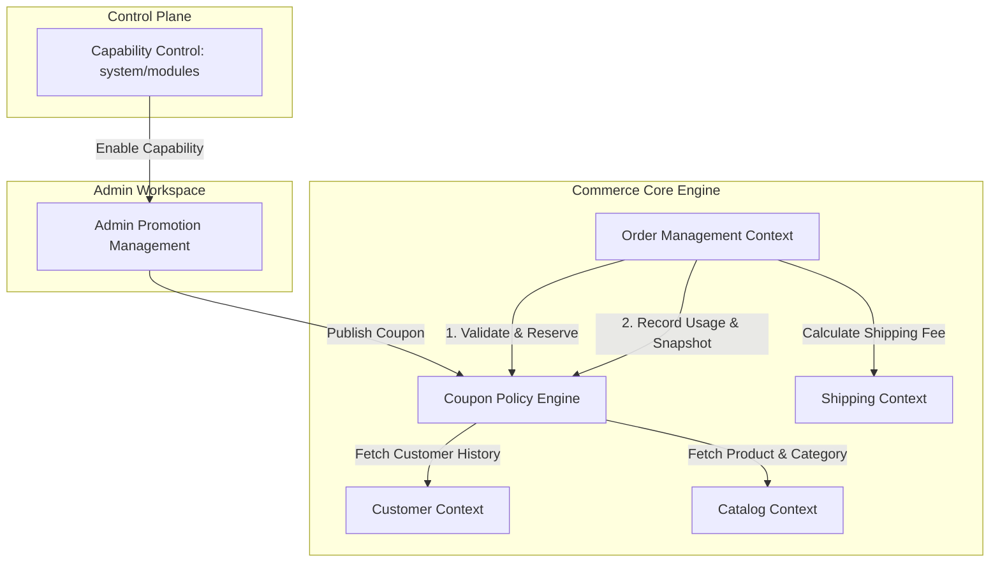

# Strategic Domain Dossier & Specification: Coupon v1

- **Hệ thống:** VietAdmin SaaS (Next.js 16 + Convex 1.43)
- **Trạng thái:** `ACCEPTED_SPEC`
- **Ngày chốt:** 03/08/2026
- **Domain Authority:** User / Product Owner
- **Mục đích:** Đặc tả nghiệp vụ chuẩn hóa cho capability Mã giảm giá (Coupon v1) từ `/system` đến `/admin` và storefront.

---

## I. Summary & Business Outcomes

- **Business Outcome**:
  - Cung cấp capability Mã giảm giá (Coupon v1) an toàn tài chính, chuẩn thương mại SaaS.
  - Cho phép `/system` quản lý capability roadmap, `/admin` vận hành mã giảm giá, storefront áp dụng mượt mà.
  - Đảm bảo tính toán chính xác, không cho phép gian lận giá từ client, ghi nhận đúng lượt dùng/ngân sách và hỗ trợ đối soát đơn hàng.
- **Target Audience / Actors**:
  - **System Admin / Dev**: Cấu hình module Khuyến mãi và tính sẵn sàng của các capability.
  - **Tenant Admin**: Xuất bản, tạm dừng, theo dõi hạn mức và báo cáo coupon.
  - **Khách hàng cuối (Shopper / Guest / Authenticated)**: Tìm kiếm mã công khai, nhập mã tại giỏ/checkout, nhận ưu đãi hợp lệ.
- **Customer Value Evidence**:
  - Tăng tỷ lệ chuyển đổi checkout nhờ ưu đãi minh bạch.
  - Kiểm soát rủi ro chi phí marketing qua 3 lớp giới hạn (tổng lượt, lượt/khách, ngân sách tổng).
  - Tách bạch giảm hàng hóa và giảm ship để hoàn tiền/đối soát chính xác.

---

## II. Strategic Context & Architecture Boundary

### 1. Phân định Control Plane vs Admin Workspace
- `/system` (Control Plane):
  - Bật/tắt module **Khuyến mãi** (`promotions`).
  - Ghi nhận roadmap capability: Coupon (Ready), Ưu đãi tự động (Roadmap/Khóa), Flash sale (Roadmap/Khóa), Combo (Roadmap/Khóa), Loyalty (Roadmap/Khóa).
- `/admin` (Tenant Workspace):
  - Chỉ hiển thị capability **Mã giảm giá** khi module đang bật và capability đã sẵn sàng.
  - Các capability chưa hoàn thiện bị khóa toggle tại `/system` và không bao giờ xuất hiện tại `/admin`.

### 2. Candidate Bounded Contexts
- `BC-CAPABILITY-CONTROL`: Quản lý trạng thái bật/tắt module và capability theo tenant.
- `BC-COUPON-POLICY`: Định nghĩa điều khoản, kiểm tra hợp lệ, tính tiền giảm và phân bổ.
- `BC-CART-PRICING`: Yêu cầu báo giá tạm thời khi khách nhập mã tại giỏ hàng hoặc checkout.
- `BC-ORDER`: Tạo đơn, giữ chỗ, chốt lượt hoặc hoàn lượt coupon.
- `BC-CUSTOMER`: Cung cấp thông tin tài khoản, lịch sử đơn xác nhận/hoàn thành và tổng chi tiêu ròng.
- `BC-PROMO-REPORTING`: Báo cáo đối soát lượt dùng, ngân sách và phân bổ giảm giá.

---

## III. Business Flow

### 1. Luồng tổng thể từ System tới Đặt đơn



### 2. Trạng thái vòng đời Coupon



- **Trạng thái điều khiển (Admin chọn):** `Nháp`, `Đã xuất bản`, `Tạm dừng`, `Lưu trữ`.
- **Trạng thái hiệu lực (Hệ thống suy ra):** `Sắp diễn ra`, `Đang áp dụng`, `Đã hết hạn`, `Hết lượt`, `Hết ngân sách`.

---

## IV. Capability Map



---

## V. Decision Register

| ID | Quyết định | Lý do & Tác động |
|---|---|---|
| `DR-001` | Giữ một module `promotions` cấp SaaS | Phù hợp bối cảnh đóng gói gói tính năng cho tenant, không vụn vặt giao diện. |
| `DR-002` | Triển khai Coupon v1 làm capability production-ready đầu tiên | Đáp ứng trực tiếp nhu cầu khách hàng thực tế. |
| `DR-003` | 4 capability roadmap hiển thị nhưng khóa toggle | Giúp Dev/System nắm roadmap sản phẩm mà không mở nhầm tính năng chưa làm xong. |
| `DR-004` | Thuật ngữ chuẩn: “Mã giảm giá” (Admin/Site), “Coupon” (Internal) | Rõ ràng, thân thiện với người dùng Việt Nam, tránh nhầm với Voucher quà tặng. |
| `DR-005` | Hỗ trợ phân phối Công khai & Riêng tư | Phục vụ cả marketing rộng rãi và chăm sóc khách hàng kín. |
| `DR-006` | Khách vãng lai được dùng mã phổ thông | Tránh cản trở luồng mua hàng vãng lai. |
| `DR-007` | Coupon nhắm đối tượng/lịch sử bắt buộc đăng nhập | Chống lách giới hạn bằng thông tin tự khai chưa xác minh. |
| `DR-008` | Quyền lợi v1: %, Tiền cố định, Miễn phí vận chuyển | Ba hình thức ưu đãi core, rõ ràng và an toàn. |
| `DR-009` | Phạm vi hàng hóa: Toàn bộ, Sản phẩm, Danh mục | Dữ liệu sản phẩm/danh mục đã có sẵn source of truth. |
| `DR-010` | Loại trừ thắng Áp dụng | Định tắc ưu tiên rõ ràng khi trùng lặp cấu hình. |
| `DR-011` | Mỗi đơn hàng chỉ sử dụng 1 coupon | Đơn giản hóa trải nghiệm, tránh xung đột quyền lợi. |
| `DR-012` | Coupon tính trên giá bán hiện hành (gồm Sale Price) | Phản ánh đúng số tiền thực tế khách đang nhìn thấy. |
| `DR-013` | Ngưỡng đơn tối thiểu tính trên Tạm tính đủ điều kiện | Không cho phép lấy sản phẩm ngoài phạm vi để gánh đủ ngưỡng. |
| `DR-014` | Miễn phí ship tính theo phí thực tế, có trần tùy chọn | Áp dụng linh hoạt cho cả ship tiêu chuẩn và ship nhanh. |
| `DR-015` | Trạng thái điều khiển tách biệt Trạng thái suy ra | Ngăn mâu thuẫn dữ liệu (như gắn Active nhưng đã hết hạn). |
| `DR-016` | Giữ chỗ khi tạo đơn, chốt khi xác nhận, hoàn khi thất bại/hủy | Bảo vệ hạn mức đồng thời không làm mất lượt oan của khách. |
| `DR-017` | Hạn mức 3 lớp: Tổng lượt, Lượt/khách, Ngân sách tổng | Kiểm soát toàn diện cả số đơn lẫn chi phí thực tế. |
| `DR-018` | Ngân sách còn lại không đủ thì từ chối toàn bộ | Không cấp mức giảm thấp hơn cam kết làm khách khiếu nại. |
| `DR-019` | Lịch: Luôn hoạt động, Khoảng ngày, Lịch lặp | Đáp ứng đủ các hình thức chiến dịch theo tuần/giờ. |
| `DR-020` | Thời gian tính theo múi giờ kinh doanh của Tenant | Nhất quán giữa cửa hàng và khách mua. |
| `DR-021` | Audience: Tất cả, Đã đăng nhập, Khách mới, Khách quay lại | Thực thi được ngay bằng nguồn dữ liệu hiện có. |
| `DR-022` | VIP, Nhóm khách, Hạng thành viên chuyển sang Roadmap | Tránh hiển thị điều kiện mà hệ thống chưa có dữ liệu thực. |
| `DR-023` | Khách mới/quay lại dựa trên đơn đã xác nhận hoặc hoàn thành | Đơn hủy/thất bại không làm mất quyền khách mới. |
| `DR-024` | Hỗ trợ điều kiện Số đơn tối thiểu & Tổng chi tối thiểu | Segment khách hiệu quả mà chưa cần hệ thống Loyalty. |
| `DR-025` | Tổng chi tiêu lịch sử là Tiền hàng ròng sau giảm và hoàn | Đảm bảo phản ánh đúng doanh thu thực thu giữ lại. |
| `DR-026` | Mã duy nhất vĩnh viễn trong từng Tenant | Tránh sai lệch đối soát và lẫn lộn lịch sử chiến dịch. |
| `DR-027` | Khóa điều khoản kinh tế sau khi phát sinh sử dụng/giữ chỗ | Bảo toàn tính toàn vẹn tài chính cho các đơn đã đặt. |
| `DR-028` | Coupon nháp được xóa, coupon đã phát hành chỉ được Lưu trữ | Giữ đầy đủ bằng chứng đối soát đơn hàng. |
| `DR-029` | Phân bổ giảm giá xuống dòng hàng, giảm ship ghi riêng | Hỗ trợ tính toán hoàn tiền một phần chuẩn xác. |
| `DR-030` | Phân bổ đơn giản, giữ tổng tiền giảm chính xác | Đơn giản hóa xử lý số dư lẻ VND. |
| `DR-031` | Giảm cố định không vượt quá Tạm tính đủ điều kiện | Tránh tạo tiền âm hoặc dư nợ cho khách. |
| `DR-032` | Cảnh báo khi xuất bản coupon % không có trần | Giúp Admin nhận biết rủi ro đơn hàng giá trị cao. |
| `DR-033` | Hoàn tiền/trả hàng không tự trả lại coupon | Giữ nguyên kết quả chiến dịch đã kết thúc; hỗ trợ cấp mã bù. |
| `DR-034` | Nhập mã tại Giỏ hàng và Checkout | Khách thấy ưu đãi sớm, trải nghiệm mượt. |
| `DR-035` | Tự động re-evaluate khi giỏ/ship/user thay đổi | Tránh sai lệch quyền lợi trước khi tạo đơn. |
| `DR-036` | Cung cấp báo cáo vận hành & đối soát trong v1 | Đảm bảo Admin kiểm soát được tình hình sử dụng. |
| `DR-037` | Đơn Admin thủ công tuân thủ đúng quy tắc Coupon | Nhất quán logic thương mại toàn hệ thống. |
| `DR-038` | Giảm giá thủ công Admin là Capability có quyền riêng | Tách bạch giữa ưu đãi coupon và ngoại lệ do nhân viên cấp. |

---

## VI. Ubiquitous Language & Business Rules

### 1. Thuật ngữ dùng chung (Glossary)
- **Mã giảm giá (Coupon):** Chuỗi ký tự đại diện cho quyền lợi ưu đãi khi khách nhập hợp lệ.
- **Tạm tính đủ điều kiện (Eligible Subtotal):** Tổng giá trị các sản phẩm thuộc phạm vi áp dụng coupon (tính theo giá bán hiện hành sau sale price, trước coupon, không gồm phí ship).
- **Giữ chỗ (Reservation):** Trạng thái khóa tạm thời 1 lượt dùng và phần ngân sách tương ứng khi đơn hàng được tạo thành công.
- **Chốt lượt (Commit):** Chuyển lượt giữ chỗ thành lượt đã dùng chính thức khi đơn được cửa hàng xác nhận hoặc hoàn thành.
- **Hoàn giữ chỗ (Release):** Trả lại lượt và ngân sách giữ chỗ khi đơn bị hủy trước khi xác nhận hoặc thanh toán thất bại.
- **Điều khoản kinh tế:** Các thuộc tính quyết định tiền giảm (Loại quyền lợi, Giá trị giảm, Phạm vi hàng hóa, Điều kiện khách, Nền tảng tính giảm).

### 2. Danh mục Business Rules với Stable ID
- `RULE-COUPON-VISIBILITY`: Capability chỉ xuất hiện ở `/admin` khi Module Khuyến mãi đang bật và Capability đã đạt trạng thái Ready.
- `RULE-COUPON-ELIGIBILITY`: Coupon hợp lệ khi: Trạng thái xuất bản = true, Nằm trong lịch hoạt động, Khách thuộc Audience, Giỏ hàng có mặt hàng hợp lệ, Đạt giá trị/số lượng tối thiểu, và Chưa chạm hạn mức/ngân sách.
- `RULE-COUPON-SCOPE`: Phạm vi áp dụng hỗ trợ: Toàn bộ, Danh sách Sản phẩm, Danh sách Danh mục. Nếu cấu hình Loại trừ, các phần tử trong danh sách Loại trừ sẽ bị loại bỏ khỏi Tạm tính đủ điều kiện (`Loại trừ > Áp dụng`).
- `RULE-ONE-COUPON`: Mỗi đơn hàng chỉ được áp dụng tối đa 1 coupon.
- `RULE-SALE-PRICE-BASIS`: Tiền giảm coupon được tính trên giá bán hiện hành của sản phẩm (bao gồm giá đã giảm sale price).
- `RULE-MINIMUM-BASIS`: Điều kiện Đơn tối thiểu và Số lượng tối thiểu chỉ được tính trên phần hàng hóa đủ điều kiện trong giỏ.
- `RULE-SHIPPING-DISCOUNT`: Coupon miễn phí ship giảm trên phí vận chuyển thực tế của phương thức khách chọn, không vượt quá Mức giảm ship tối đa (nếu có).
- `RULE-COUPON-LIFECYCLE`: Hệ thống tự động suy ra hiệu lực coupon dựa trên thời gian thực và hạn mức, Admin chỉ điều khiển trạng thái xuất bản/tạm dừng/lưu trữ.
- `RULE-USAGE-RESERVATION`: 
  - Tạo đơn thành công -> Giữ chỗ 1 lượt + Ngân sách tương ứng.
  - Đơn được xác nhận/hoàn thành -> Chốt lượt + Ngân sách.
  - Đơn hủy trước xác nhận/thanh toán lỗi -> Hoàn lượt + Ngân sách.
- `RULE-BUDGET-EXHAUSTION`: Ngân sách khả dụng (Ngân sách tổng - Ngân sách đã chốt - Ngân sách đang giữ) nếu nhỏ hơn số tiền giảm dự kiến của đơn -> Từ chối áp dụng coupon.
- `RULE-COUPON-SCHEDULE`: Hỗ trợ Lịch luôn hoạt động, Theo khoảng ngày, và Lịch lặp (Thứ trong tuần + Khung giờ). Mọi phép tính thời gian theo múi giờ cửa hàng (Tenant Timezone).
- `RULE-COUPON-AUDIENCE`: Hỗ trợ: Tất cả khách, Chỉ khách đăng nhập, Khách mới (0 đơn xác nhận/hoàn thành), Khách quay lại (>= 1 đơn xác nhận/hoàn thành).
- `RULE-CUSTOMER-HISTORY-CONDITIONS`: Với khách đăng nhập, hỗ trợ điều kiện Số đơn tối thiểu và Tổng chi tiêu tối thiểu (tính trên tổng tiền hàng ròng các đơn đã xác nhận/hoàn thành).
- `RULE-COUPON-CODE-UNIQUENESS`: Mã coupon duy nhất vĩnh viễn trong từng Tenant (không phân biệt hoa/thường). Không tái sử dụng mã đã từng phát hành.
- `RULE-COUPON-IMMUTABILITY`: Sau khi phát sinh giữ chỗ/sử dụng, khóa toàn bộ Điều khoản kinh tế. Chỉ cho phép sửa thông tin hiển thị, mở rộng thời gian, tăng hạn mức hoặc tạm dừng.
- `RULE-COUPON-RETENTION`: Coupon nháp chưa từng dùng có thể Xóa. Coupon đã phát hành hoặc có lịch sử sử dụng chỉ được Lưu trữ.
- `RULE-DISCOUNT-ALLOCATION`: Tiền giảm hàng hóa được phân bổ xuống từng dòng hàng hợp lệ theo tỷ trọng giá trị. Giảm phí ship ghi nhận vào trường giảm ship riêng.
- `RULE-MONEY-ROUNDING`: Tất cả số tiền lưu dạng số nguyên VND. Phân bổ tiền giảm làm tròn đến 1 VND, phần dư lẻ gán vào dòng hàng hợp lệ đầu tiên.
- `RULE-FIXED-DISCOUNT-CAP`: Số tiền giảm cố định không vượt quá Tạm tính đủ điều kiện của đơn.
- `RULE-SERVER-AUTHORITY`: Server Convex tự tính toán lại toàn bộ tiền giảm dựa trên dữ liệu giỏ/sản phẩm thực tế trong DB. Tuyệt đối không tin tưởng số tiền giảm do Client gửi lên.
- `RULE-MANUAL-DISCOUNT-AUDIT`: Giảm giá thủ công do Admin nhập khi tạo đơn phải qua phân quyền riêng, bắt buộc nhập lý do và lưu vết người thực hiện.

---

## VII. Behavior & Scenario Seeds (Gherkin)

### SEED-01: Áp dụng Coupon & Tính toán quyền lợi
- **SCN-01 (Giảm % có trần):**
  ```gherkin
  Given Coupon "SALE20" giảm 20%, giảm tối đa 100.000đ đang hoạt động
  And Giỏ hàng có 1 sản phẩm A trị giá 800.000đ đủ điều kiện
  When Khách áp dụng mã "SALE20"
  Then Số tiền giảm được tính là 100.000đ (do trần 100K < 160K)
  And Tổng tiền hàng sau giảm là 700.000đ
  ```
- **SCN-02 (Phạm vi danh mục & Loại trừ):**
  ```gherkin
  Given Coupon "FASHION" giảm 10% cho danh mục "Thời trang", loại trừ sản phẩm "Áo khoác VIP"
  And Giỏ hàng gồm: 1 Áo thun (Thời trang, 200.000đ) và 1 Áo khoác VIP (Thời trang, 500.000đ)
  When Khách áp dụng mã "FASHION"
  Then Tạm tính đủ điều kiện là 200.000đ (Áo thun)
  And Số tiền giảm được tính là 20.000đ
  ```
- **SCN-03 (Khách vãng lai dùng mã yêu cầu đăng nhập - Negative Path):**
  ```gherkin
  Given Coupon "WELCOME" chỉ dành cho "Khách mới"
  And Người mua chưa đăng nhập tài khoản
  When Người mua nhập mã "WELCOME" tại Checkout
  Then Hệ thống từ chối áp dụng mã
  And Hiển thị thông báo "Vui lòng đăng nhập để sử dụng mã giảm giá này"
  ```

### SEED-02: Giữ chỗ & Chốt hạn mức (Concurrency & Reservation)
- **SCN-04 (Giữ chỗ khi tạo đơn thành công):**
  ```gherkin
  Given Coupon "LIMITED" có giới hạn tổng lượt sử dụng là 10, hiện đã dùng 9 lượt, chưa có lượt giữ chỗ
  When Khách hàng A tạo đơn thành công với mã "LIMITED"
  Then Lượt giữ chỗ tăng lên 1 (Tổng cam kết = 10)
  And Coupon chuyển trạng thái suy ra sang "Hết lượt"
  When Khách hàng B cố gắng tạo đơn tiếp theo với mã "LIMITED"
  Then Hệ thống từ chối và báo mã đã hết lượt
  ```
- **SCN-05 (Hoàn giữ chỗ khi thanh toán thất bại):**
  ```gherkin
  Given Khách hàng A đã tạo đơn thành công giữ chỗ 1 lượt mã "LIMITED"
  When Đơn hàng của Khách hàng A bị hủy hoặc hết hạn thanh toán VietQR
  Then Lượt giữ chỗ của đơn hàng được giải phóng (-1)
  And Trạng thái Coupon suy ra tự động quay lại "Đang áp dụng"
  ```

### SEED-03: An toàn giao dịch & Phân bổ tài chính
- **SCN-06 (Client gửi tiền giảm giả mạo - Security Guard):**
  ```gherkin
  Given Coupon "DISCOUNT10" giảm 10k cho đơn 100k
  And Khách hàng can thiệp API checkout gửi `discountAmount: 90000`
  When Client gọi mutation `placeOrder`
  Then Server Convex bỏ qua giá trị `discountAmount` từ Client
  And Server tự tính toán lại số tiền giảm thực tế là 10.000đ
  And Đơn hàng được tạo với đúng số tiền giảm 10.000đ
  ```

---

## VIII. Context Map (As-Is vs Target)

### 1. As-Is Context Map (Hiện trạng nợ kỹ thuật)



### 2. Target Context Map (Mục tiêu chuẩn hóa)



---

## IX. Scope Breakdown: V1 vs Roadmap

### Scope thuộc Coupon v1 (Triển khai chính thức)
1. **System & Module Wiring:** Toggle Capability Coupon tại `/system`, chỉ mở UI Admin Coupon khi Capability bật.
2. **Authoring & Lifecycle:** Quản lý mã (Thêm/Sửa/Lưu trữ), tự động suy ra trạng thái hiệu lực, khóa điều khoản kinh tế khi đã phát sinh lượt.
3. **Quyền lợi v1:** Giảm %, Giảm cố định, Miễn phí vận chuyển (có trần tùy chọn).
4. **Phạm vi & Loại trừ:** Toàn bộ, Sản phẩm chọn lọc, Danh mục chọn lọc + Danh sách loại trừ (`Loại trừ > Áp dụng`).
5. **Điều kiện áp dụng:** Giá trị đơn tối thiểu, Số lượng hàng tối thiểu (tính trên Tạm tính đủ điều kiện).
6. **Đối tượng khách:** Tất cả, Chỉ đăng nhập, Khách mới, Khách quay lại, Số đơn tối thiểu, Tổng chi tiêu tối thiểu.
7. **Hạn mức 3 lớp:** Tổng lượt dùng, Lượt dùng/khách, Ngân sách tổng.
8. **Lịch hoạt động:** Luôn hoạt động, Khoảng ngày, Lịch lặp (Thứ + Khung giờ).
9. **Kênh phân phối:** Mã công khai (hiển thị Site) & Mã riêng tư.
10. **Transaction Integrity:** Giữ chỗ khi tạo đơn, Chốt khi xác nhận, Hoàn khi hủy/lỗi. Server recalculate 100%.
11. **Giảm giá thủ công Admin:** Phân quyền riêng, yêu cầu nhập lý do, lưu audit log.
12. **Báo cáo:** Thống kê lượt giữ, lượt chốt, ngân sách cam kết/đã dùng, danh sách đơn hàng liên quan.

### Scope thuộc Roadmap (Chưa triển khai trong v1, khóa toggle tại `/system`)
- **Ưu đãi tự động (Automatic Promotions):** Tự động giảm giá theo giỏ hàng mà không cần nhập mã.
- **Flash Sale Engine:** Quản lý đợt giảm giá chớp nhoáng theo khung giờ và kho hàng riêng.
- **Combo / Mua kèm (Bundle Promotions):** Mua X tặng Y, Mua A tặng B, Giảm giá theo bậc (Tiered).
- **Loyalty & Membership:** Quy đổi điểm thưởng, hạng thành viên VIP, Voucher quà tặng độc lập.
- **Cộng dồn nhiều Coupon:** Áp dụng đồng thời 2+ mã giảm giá trên một đơn hàng.
- **Analytics nâng cao:** Phân tích ROI marketing, Attribution kênh bán, A/B testing mã giảm giá.

---

## X. Strategic Readiness Checklist Verification

- [x] **Glossary:** 100% thuật ngữ cốt lõi được thống nhất, loại bỏ từ "Voucher" gây nhầm lẫn.
- [x] **Subdomain & Context:** Phân ranh rõ ràng між Control Plane (`/system`) và Admin Workspace (`/admin`).
- [x] **Business Rules:** 23 quy tắc nghiệp vụ có Stable ID (`RULE-*`) được đặc tả chi tiết.
- [x] **BDD Seeds:** 3 bộ feature seeds (`SEED-*`) với 6 kịch bản chi tiết (`SCN-*`) bao gồm cả Happy Path và Security/Negative Path.
- [x] **No Blockers:** Mọi thắc mắc về phân bổ tài chính, làm tròn số tiền, xử lý guest và hủy đơn đã được chốt hoàn toàn.
- [x] **Readiness Status:** `READY_FOR_IMPLEMENTATION`
